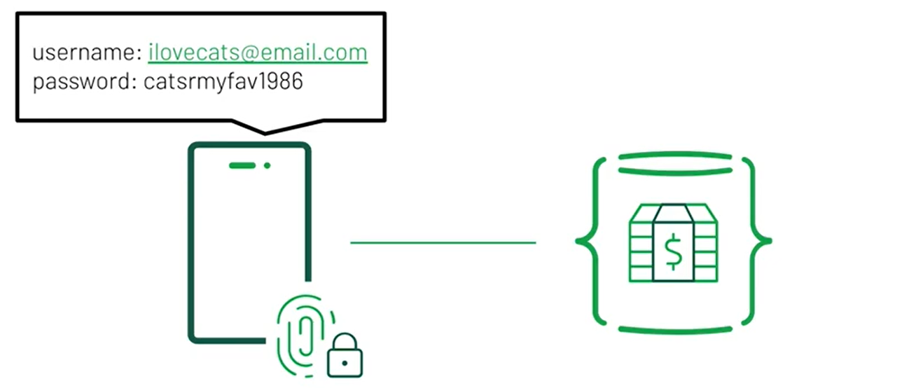
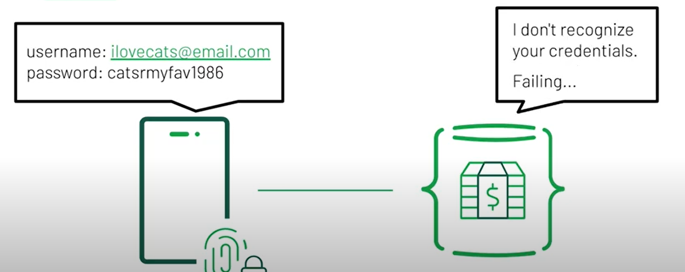
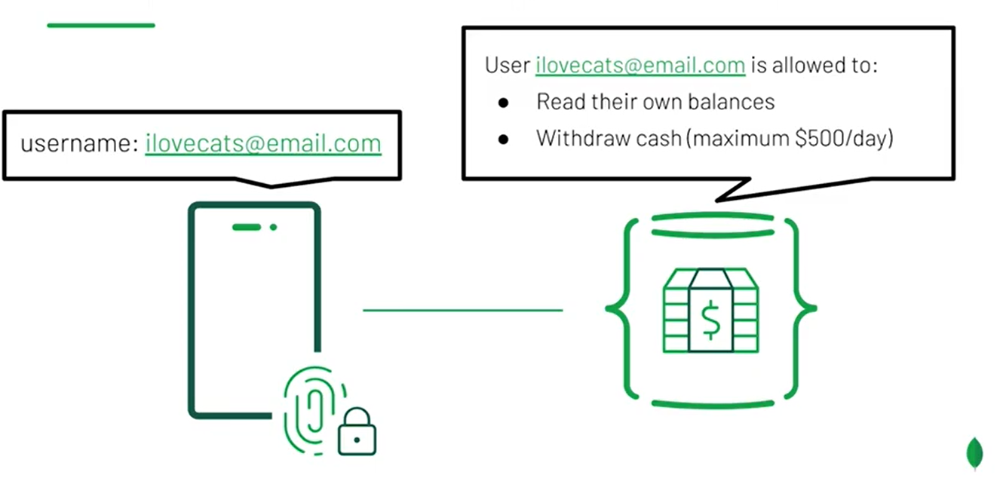
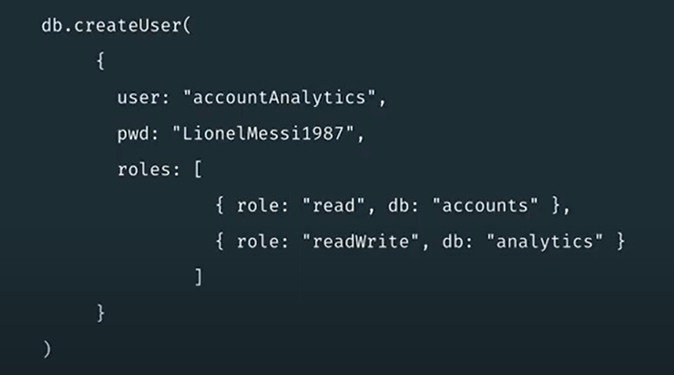
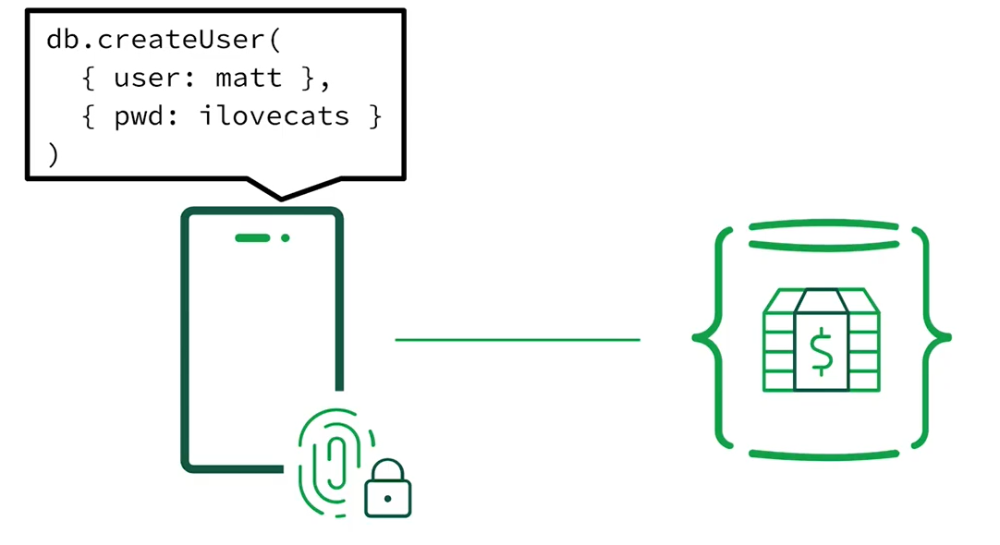
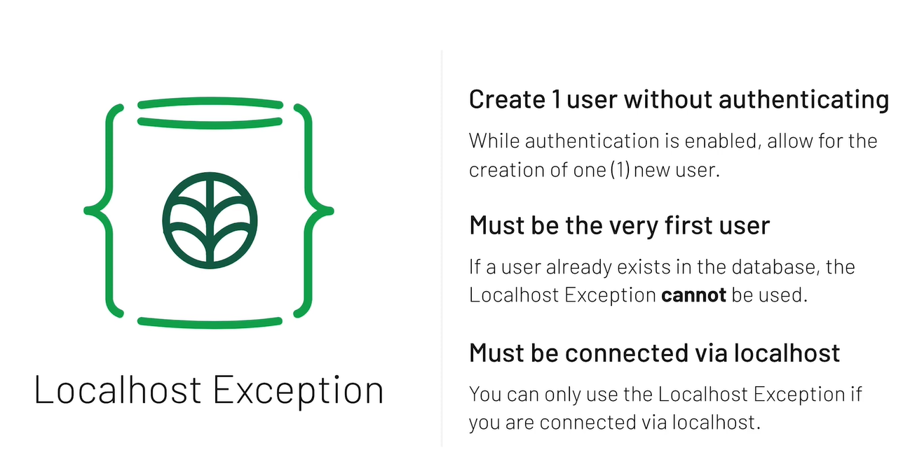

# Welcome to M150

## Agenda

### Authenticating Database Clients

### Role-Based Access Control

### Authenticating Internal Connections

### Tying it all together

# Authentication vs. Authorization

1. Authentication determines the **identity** of the user.
2. Authorization determines the verified user's **access** to resources and operations.

# Authentication

- So let's say you're checking your bank account.
- Your account balances live in a database.
- But before you can read the balances the database needs to verify your identity as the user.
  
- So the server prompts the user to prove itself by asking the user, please enter your email address and password.
- The user then presents their username ilovecats@email.com and their password catsrmyfav1986
- That would be an example of updating this user's authentication.
- So after inputting the password in the username, the server will then verify this user's identity based on whether that user exists with those credentials.
  - If the database does not recognize the credentials, it will send a message to the user saying that the authentication has failed.
    
  - If the database does recognize the user's credentials then it automatically moves on to authorization.
    

# Authorization

- Once MongoDB verifies the identity of a user at that needs to determine this user's authorization.
- Coming back to our example, the database has verified the credentials for the user ilovecats@email.com.
- Now the database has to determine what level of access this user has.
- The actions that a given user is allowed to perform are referred to as privileges.
  In the case of a bank account or an ATM this user has access to their account balances.
- In other words, they are not authorized to read the balances of other users bank accounts.
- This user is also authorized to withdraw money from their account but there's a limit to how much money can be withdrawn each day.
- But you can contact your bank to raise this limit.
- Raising the withdrawal limit is an example of changing authorization without affecting the way that this user authenticates to the server.
  
- So now let's see how authorization and authentication are represented in MongoDB.
- On the screen is a command that creates a new user with a username and password.
  
- So the first item here is the db.createUser command.
  - This is the command used to create new users.
  - It only requires one parameter, the user document.
  - The user document contains all the information that MongoDB saves about each user.
  - The portion of the user document that is highlighted pertains to authentication.
  - For this user, the user document contains user name account analytics and the password Lionel Messi 1987.
  - Now the portion of the user document that is highlighted right now pertains to authorization.
  - Below the credentials is an array field called roles.
- Roles are one of the primary ways of granting privileges to a user.
  - Each role is an alias for a collection of privileges.
  - The roles that you see here read and readWrite are built in roles, meaning that they're included with MongoDB being so you don't need to create these roles by yourself.
  - MongoDB created these roles so administrators can easily group privileges together.
  - But admins also have the ability to create their own custom roles with any privileges that they choose.
- So the first role was the readRole on the accounts database.
  - Having the role and no other privileges on the accounts database means that the account analytics user can read data from the accounts database but it can't write any new data.
  - This user also has the readWrite role on the analytics database.
  - This means that our user can read data and the analytics database as well as writing new data to that database.
- MongoDB's access control system allows us to issue permissions to users in this granular way.
  - So administrators have greater control over what actions users are allowed to perform.

## Recap

- Let's recap what we learned.
- Authentication is the process of determining who you are.
- The database prompts users for credentials to prove their trust and users can send a username and password as their credentials.
- Authorization is the process of determining what you can do.
- Different users have varying levels of database access.
- And MongoDB contains built in roles for specific users such as read and readWrite.

# Review the QA Feedback

Review the QA Feedback
Opening the file mongod.conf:
`vi mongod.conf`

The new section of the configuration file that enables authentication and authorization:
`security:`
`authorization: enabled`
Note: Make sure to follow YAML standard when appending above commands in the file.

Shutting down the server:
`mongo admin --port 27001 --eval 'db.shutdownServer()'`
_You can verify that this was successful by running the command pgrep -l mongod to search for all running processes with the word "mongod" in their name. If it returns nothing, then your MongoDB instance is shut down._

Restarting the server with mongod.conf:
`mongod -f mongod.conf`

Connecting to MongoDB on port 27001:
`mongo --port 27001`

Running a find() query on the accounts database:
`db.accounts.find( {}, { name: 1, ssn: 1 } )`

# Creating First User

- In this lesson, we'll discuss creating the first user in MongoDB while authentication is enabled, and then we'll log in or authenticate as that user.
- So let's briefly discuss the scenario where authentication is disabled.
  - Here the user is trying to create a new user, Matt, with the password Ilovecats.
  - In the case where authentication is disabled, we can just create a user as soon as we connect to the database.
  - The database won't enforce authentication so anyone can perform any actions that they want.
- **However, most database deployments require authentication all the time.**
  - If authentication is being enforced, this user will not be able to run this Create user command.
  - The database will say, who are you?
  - And then prompt the user for their username and password.
  - _The issue is that there are no username and password combinations that the server would accept, because the server doesn't have any users yet._
  - Essentially, we need a way of creating the very first user on the database while the database is still enforcing authentication.
    
- To get around this, we will use something called the **localhost exception**.
  - The localhost exception is an exception that allows you to create one single user without having to authenticate first.
  - It says, that while authentication is enabled, allow for the creation of one user.
  - _This directly pertains to the scenario where authentication is enabled but no users exist yet._
  - _The caveat here is that it must be the very first user._
  - _If a user already exists in the database, the localhost exception cannot be used._
    
- The next important thing to note is that you must be connected via localhost in order to use the localhost exception.
  - Localhost is a special type of connection that can only be made locally.
  - Meaning that if you want to connect to a machine via localhost, you have to already have access to the physical machine.
  - The idea is if we can't enforce authentication for creating the first user, we can at least ensure that whoever creates that first user has access to the physical server, where MongoDB is running. This is usually an administrator or some other database owner.

### Lecture Notes

Printing out the configuration file:
`cat ~/workspace/mongod.conf`

Connecting to MongoDB:
`mongo --host localhost:27001`

Retrieving all users:
`db.getUsers()`

Switching to the admin database:
`use admin`

Creating the user administrator:

````db.createUser({
user: "globalAdminUser",
pwd: "5xd49$4%0bef#6c&b\*d",
roles: [ { role: "userAdminAnyDatabase", db: "admin" } ]
});```

Authenticating as the user administrator:
`db.auth( "globalAdminUser", "5xd49$4%0bef#6c&b\*d" )`

Creating a cluster administrator:
```db.createUser({
user: "clusterAdminAny",
pwd: "a\*0f7@2c6#b4f%$d6c^c7d",
roles: [ "clusterAdmin" ]
});

````
