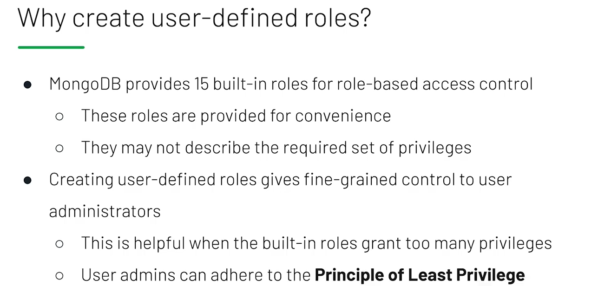
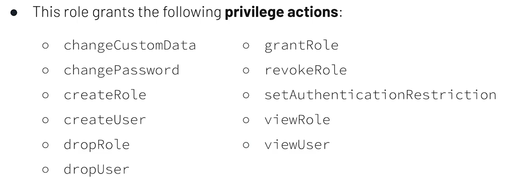
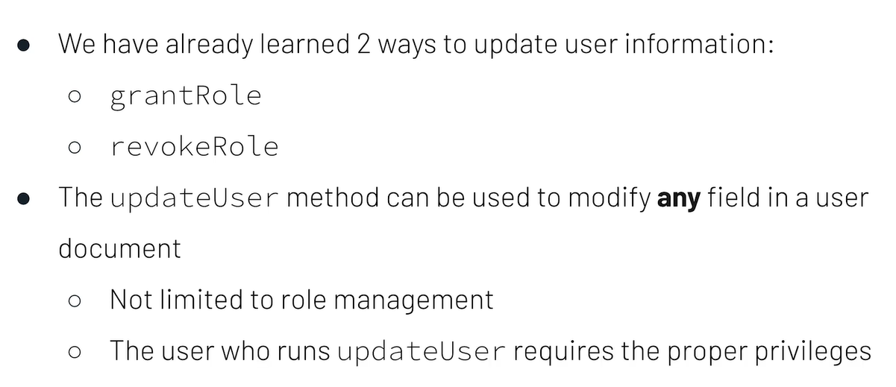

# Built in Roles

- Two roles will be discussed
  - **userAdminAnyDatabase**
  - **userAdmin**
- Two different ways to grant roles to users will be discussed
  `use admin`

### First Way of Assigning Roles

`db.createUser({ user: "globalAdminUser", pwd: "5xd49$4%0bef#6c&b\*d", roles: [ { role: "userAdminAnyDatabase", db: "admin" } ] });`

- Aformentioned two lines of code used to create a user administrator in MongoDB.

  - The first line, use admin, is used to switch the mongo shell to direct commands to the admin database.
    - This will ensure that our new user is created on admin.
    - And because it's created on admin, we actually need to be connected to the admin database when we authenticate as this new user.
  - The roles array contains all the roles that we want to assign to this new user.

- In this example, it's just a single document representing the role userAdminAnyDatabase.
- This role grants the privilege to create and modify users on _any database_ in the deployment.

- In fact, this role is only available from the admin database, which is why we need it to be connected to admin in order to assign this role.

- This is one of the few roles that's only available from admin, and you can identify these roles by the ending anyDatabase.

- So, for example, userAdminAnyDatabase.
- Here's a very similar block of code.
  `use admin`
  `db.createUser({ user: "inventoryAdminUser", pwd: "f46*5$2a3%ac&43f@17b", roles: [ { role: "userAdmin", db: "inventory" } ] });`
- But in this case, instead of assigning the role userAdminAnyDatabase, we've assigned the role userAdmin.
  - This role still grants the privilege to create and modify users, but _only on one database_.
  - In this example, it's the inventory database.
  - So this is the first way to grant roles to users- - by assigning roles as the user is being created inside the db.createUser() command.

### Second Way of Assigning Roles

- The second way is to assign roles to existing users.
- And we'll use a new command for that.
- In this case, the roles array is empty, which means that when we create this user, it has no privileges.

`use admin`
`db.createUser({ user: "inventoryAdminUser", pwd: "4lf12$@0af0e4*9#8af", roles: [ ] });`

- And here's a new command called `db.grantRolesToUser()`, and it's used to grant roles to users.
  `db.grantRolesToUser( "inventoryAdminUser", [ { role: "userAdmin", db: "inventory" } ] )`
  - The first argument is a string with the name of the user, and the second argument is a roles array with all the roles that we want to assign to this new user.
  - In this case, it's the userAdmin role on the inventory database.

### Recap

- Some roles are built into MongoDB.
- The userAdminAnyDatabase role is only available from the admin database.
- The userAdmin role is available from any database.
- Roles can be granted using db.createUser() and using db.grantRolesToUser().
- And using this information, you should be able to grant roles to users in MongoDB.

# User Defined Roles

The slides has a better explanation so adding the screenshots here:

## Why Create User Defined Roles?



## Principle of Least Privilege


## Built in Roles for userAdmin



## Lecture Notes

If you want to learn about the operations associated with a specific privilege action, visit the Privilege Actions docs page.

Connecting to MongoDB on port 27001:
`mongo admin --port 27001`

Authenticating as the user administrator:
`db.auth("globalAdminUser", "5xd49$4%0bef#6c&b\*d")`

Creating a new role grantRevokeRolesAnyDatabase:

```db.createRole(
 {
   role: "grantRevokeRolesAnyDatabase",
   privileges: [
     {
        resource: { db: "", collection: "" },
        actions: [ "grantRole", "revokeRole", "viewRole" ]
     }
   ],
   roles: []
 }
```

'db' and 'collection' are empty means that it applies to all DBs and Collections!

Retrieving all roles:
`db.getRoles() `

# Update User Information

# Multiple Methods to Update User Information



```db.updateUser(
    "<username>",
    {
        roles:[
            {role: "<role>", db: "<database>"} | "<role>",
        ],
    }
    pwd: "<new-passsword>",
    mechanism: ["<auth-mechanism>"],
    },
)
```

Note: 'roles' will replace all the roles, not append new ones. Check this:
https://www.mongodb.com/docs/manual/reference/method/db.updateUser/
