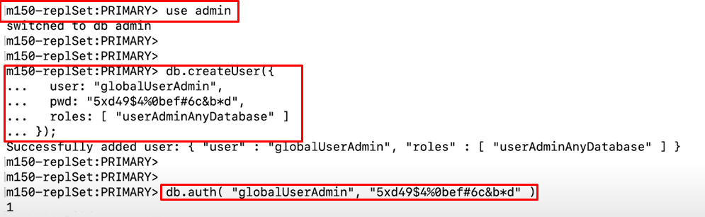

# Internal Authentication

- **Internal Authentication** will be discussed in this lecture!
- So until this point, we've discussed how users from outside MongoDB connect to MongoDB and then authenticate.
- By asking outside users to authenticate, MongoDB can verify a user's identity before they connect to MongoDB.
- But a MongoDB cluster often consists of more than one instance of MongoDB.
- So let's look at an example.
- A MongoDB replica set is a group of MongoDB instances that together provide high availability.
  
- And these different instances need to communicate with each other.
- The outside users are still authenticating to MongoDB, so the connection from the user to the replica set is still secure.
- **But we also need to secure the connection between each instance of MongoDB.**
  - This is called **Internal Authentication**.
  - Internal authentication verifies the identity of one MongoDB instance to another.
  - Internal authentication is very important to the security of a MongoDB replica set because it prevents unauthorized MongoDB instances from joining the set and then replicating data.
  - In a replica set where internal authentication is not enabled there is no mechanism for verifying new MongoDB instances that join the cluster.
  - So the replica set members don't know who they can trust.
  - Theoretically, an attacker might be able to add a rogue secondary member to this replica set, and then siphon any data that was being replicated from the primary.
  - This could allow someone to read sensitive data from a replica set.
    
- Let's explore how a person could do this.
  - In order to add a rogue member to this replica set, the attacker would need to do two things first.
    1. One they would have to connect to the primary node in this replica set
    2. They would need to authenticate to the primary as a cluster admin or some other user with the privilege to add new members to the replica set.

### Recap

- Internal authentication verifies the identity of one MongoDB instance to another.
- Without internal authentication somebody could add a rogue member to a replica set.
- But a rogue member can only be added if the attacker has access to the primary node and the login credentials for a cluster admin user.

# SCRAM Internal Authentication with Keyfiles

Keyfile must be presented to other entities during authentication as it can be seen below:


Checking the keyfile of all the node members


Modifying configuration for first member by 'vi' command:


Entering the config details for first member:


Editing every member in the similar fashion.

**Now all configuration files have been modified to use keyfiles for Internal Configuration**

**Start Each Member Of Replica Set**


Connecting on of the members of Replica Set using `rs.initiate()` command:

Since we are now connected at Localhost, we can use Localhost Exception to create first user.


## Recap


## Lecture Notes

Identifying one of the keyfiles in the Unix shell:
`ls /var/mongodb/pki/1/mongod-keyfile`

The new section of the configuration file that enables internal authentication:
security:
`keyFile: /var/mongodb/pki/1/mongod-keyfile`

Deploying MongoDB with mongod1-auth.conf:
`mongod -f mongod1-auth.conf`

Connecting to MongoDB on port 27001:
`mongo admin --host localhost:27001`

Initiating the replica set:
`rs.initiate()`

Creating the global user administrator:

```
db.createUser({
user: "globalUserAdmin",
pwd: "5xd49$4%0bef#6c&b\*d",
roles: [ "userAdminAnyDatabase" ]
});
```

Authenticating as the user administrator:
`db.auth( "globalUserAdmin", "5xd49$4%0bef#6c&b*d" )`

**NOTE:**
In the activity lab, this is how the Replica Set has been initiated:

```
rs.initiate(
   {
      _id: "m150-replSet",
      version: 1,
      members: [
         { _id: 0, host : "localhost:27001" },
         { _id: 1, host : "localhost:27002" },
         { _id: 2, host : "localhost:27003" }
      ]
   }
)
```

# x509 - Alternate to SCRAM Authentication

- SCRAM required `keyFiles`. x509 requires `certificates` for authentication.
- Cerificate is generally more secured than Username and Password because it is longer and more complex.

## What are x509 Certificates?


Each member of Replica Set contains certificate to authenticate itself.
Note: Credential is a keyfile in SCRAM method. Here, it is Certificate.
**TLS** is used for Encryption purpose in x509.

## Recap


