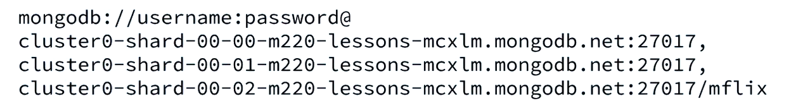
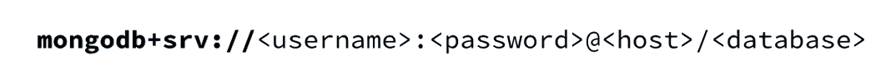
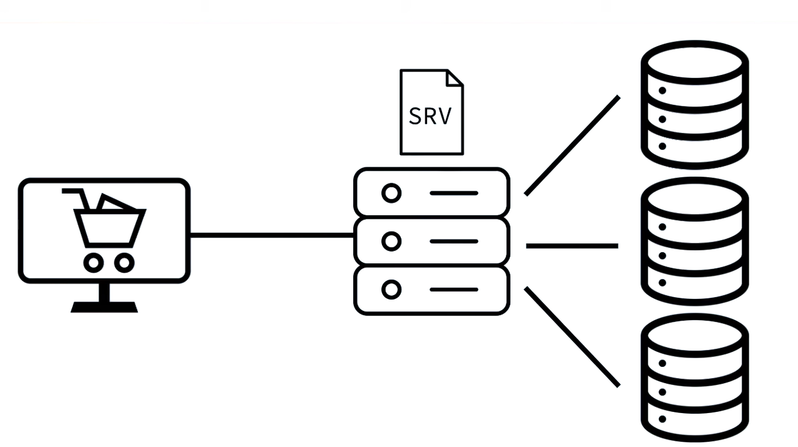
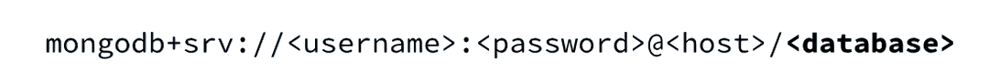
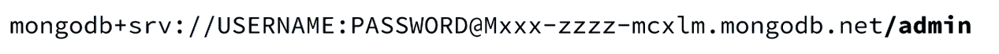
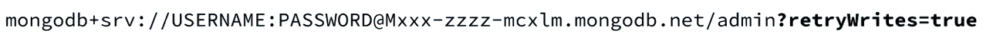

# Introduction

We will be working on mFlix using MERN stack.

# MongoDB URI

- URI = Uniform Resource Identifier
- Defines **connections between application and DB**

Example of URI is: 

Now SRV is used as shown below:

Lets see this connectivity example:

- The hostname is the address of the file called SRV record or service record.
- This service record will define its own DNS with a list of host names that we want to resolve to.
- **So even though we are connecting to a cluster of servers, we don't need to know where each server in the cluster is,** **`because the SRV record keeps track of it for us.`**

  - This is especially useful when the servers in our clusters change or rotate out, because the SRV record will be updated to reflect this.
  - And we don't need to change anything in our client side.

- This part of the connection string is the authentication database.

Template Example:

The values can be inserted as:

Here we can see that we are now connecting to 'admin' database

We can also use other options in query parameter as shown below:

This option will retry by default if a connection error arises.
