# Pre-requisite

You should be aware of the introductory course and be aware of basic DB concepts like crow notation.

# Data Modeling in MongoDB

## Misconception 1

- One of the most common **misconceptions** about data modeling in MongoDB is that modeling is `schemaless`,
- it doesn't really matter which field documents have or how different the documents can be from one another, or even how many collections you might have per database.
- It is not the **REALITY**

# Reality

- Although that can be a flattering way of positioning in the flexibility of MongoDB, this is not practical in reality.
- What MongoDB unquestionably has is a very flexible data model.
- There are no default rules on what documents should be looking like apart from having correctly been defined in BSON and containing a primary key.
- But most importantly, all data as some sort of structure and therefore, a schema.

# Benefit

- Before you jump into an ERD or UML tooling, in order to determine the full scope of your data structures,
- it tends to be preferable to start building your application and finding out from that particular experience what the data structure should look like.
- _However, if you do know your usage pattern how your data is accessed, which queries are critical to your application, and ratios between reads and writes, you will be able to extract a very good model, even before rewriting the full application to make it scale with MongoDB._
- You will be able to accommodate those changes without experiencing a painful migration process, like in traditional relational databases.
- When you start having a pretty good idea of how documents should be looking like and should be shaped out and which data types those fields you have, you'll be able to enforce those rules in MongoDB by using **document validation**.

## Misconception 2

- All information, regardless of how data should be manipulated, can be stored in one single document.
- There are some use cases where this approach is actually correct.
- But the reality is that this is not the way applications in general use data.
- Think about your user profile, where we have a profile data.
- And that gives us the current state of the user.
- But when thinking about all the different changes that that given user might incur over a period of time, like for example, all the variations in musical tastes, profile messages, new friendships, new likes, new reviews, new romantic partnerships, you might get a good understanding that that profile will grow.

## Drawback:

- If you tried to store all that information, 99% of the time all you do is get the latest version of that profile.

- You might not be helping your application all that much by storing all these sorts of information of that user in one big document.

- As a user interacts more with your application, more data will be accumulated, and your performance will be dropping considerably.

## Solution

- Keeping the amount of information stored per individual documents to the data that your application uses and having different models to deal with historical data or other types of data that are not always accessed is something that we'll be looking into in this course, as well.

## Misconception 3

- There is no way to perform a join between documents in MongoDB.
- While MongoDB does not call dollar look up a join, for many good reasons, you can still perform all sorts of joins in MongoDB.
- But it can certainly do these types of relational operations in MongoDB.

# Document Model in MongoDB

Document is like a "row" from tabular DB concepts.

## Data-Heirarchy

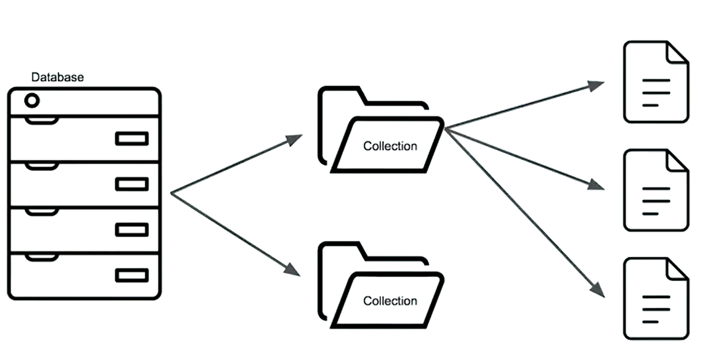

Data in MongoDB is stored in BSON which is very similar to JSON

Following is the example of JSON:
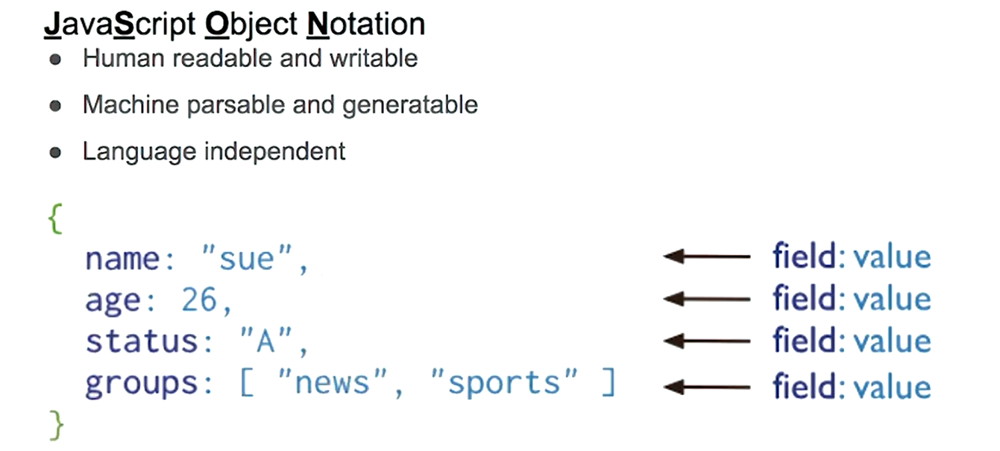

Following is the example of Document:
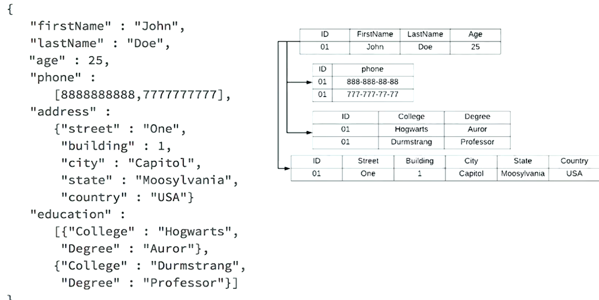

Document has Schema:

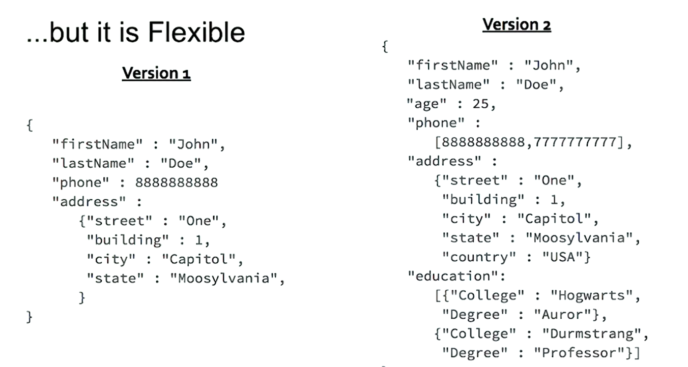

Recap:

# Constraints in MongoDB

- Hardware

  - RAM
  - SSD / HDD

- Data

  - Size
  - Security, Sovereignty

- Application

  - Network Latency

- Database Server / MongoDB
  - Atomocity of updates , 16 MB per document is the limit.

## Misconception 4

- MondoDB doesn not use transactions
- As for writes, if you need to write too many documents, well, you will use a transaction with the traditional tabular databases, which are frequently referred as relational databases.
- However, you can simplify your application and avoid using transactions by storing all the information that needs to be updated in a single document, as a write to a document is ACID compliant.
- In other words, transactions are a must-have in tabular databases.
- However, in a document database like MongoDB, you can do well without them.
- But just to be clear, MongoDB does support transactions.

## Working Set

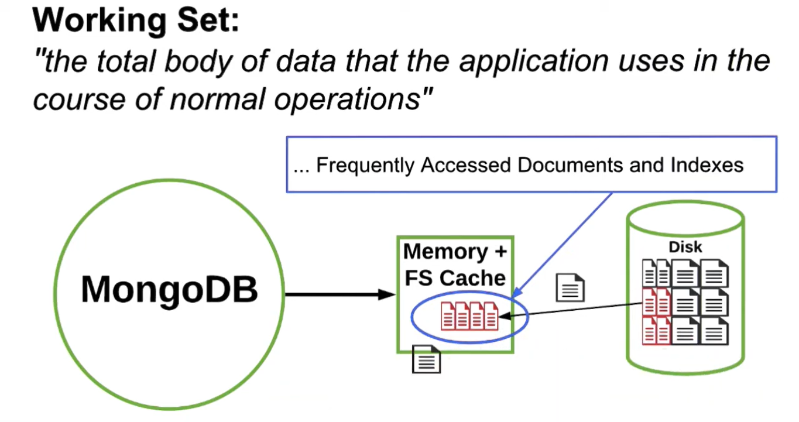

- Frequently Accessed Data:

  - As you know or may have guessed, if you can keep the old database in RAM, it will give you very good performance.
  - However, it is often not practical or may just be a waste of money.
  - What you want to aim for is keeping the data that is frequently accessed and needs to be returned quickly in RAM.
  - We refer to this data as the **working set**.
    - A definition for the working set would be the total body of data that the application uses in the course of normal operations.

- In this picture, the chunk of data in red are the ones we want to keep in memory, while we still have some RAM left to swap information that is used less often in and out from the disk.
- In summary, keep these in **RAM**:
  - **Frequently Accessed Documents**
  - **Indexes**
    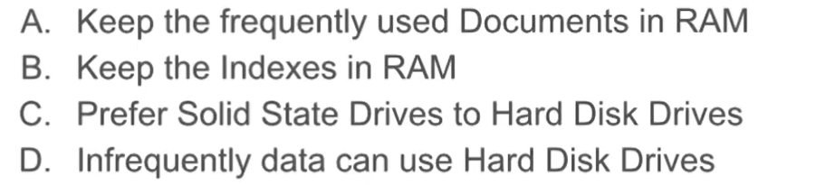

# Data Modeling Methodology

## Methodology Diagram

Identifying basics entities and forming some sort of relationship
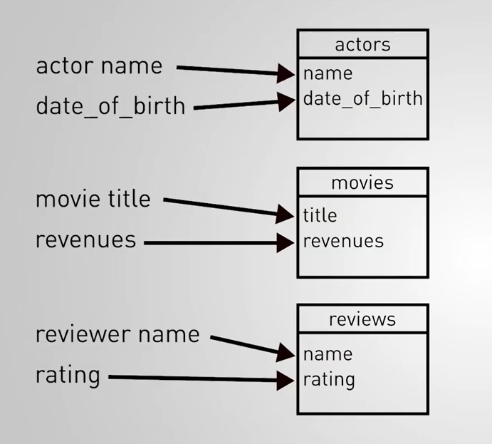

- For example, a movie title has a one-to-many relationship to the reviews for the movie, while the money earned by the movie has a one-to-one relationship with the movie title.
- So the movie title and its revenues are in the same entity or collection, while the reviews are in a separate collection.
- With MongoDB, you follow the same process of identifying the relationships between the pieces of information.
- However, you need to decide if you embed information or keep it separate.
  - How do you decide?
  - This is where you start using the knowledge you will acquire in this class.
- At the end of this process, you will have a list of entities with their fields, some of them grouped together inside the common collection.
- **Our last phase is to apply schema design patterns.**
- This is where you will get to make your model more performant or more clear by applying some transformations.
  - We will cover this phase of the methodology in a future chapter by giving you a number of recipes you can apply to your model.
  - If any of the input information on the left changes, you need to assess the impact on the decision you've made in their corresponding phase.
  - For example, if you discover another reported query, get more data about the size of your problem, or run benchmarks on your current solution, all that known information, with feedback as the input to the model.
  - Any successful application will undergo modifications at some point in its lifetime, so be ready to get new inputs at some point.
  - If you track why you made some decision and what were the assumptions in the past, it will be much easier to apply the needed changes.

## Recap

- There are three phases in our methodology.
  1. The first addresses the workload.
  - You want to identify the size of your data, the important reads and writes of the system, and possibly quantify and qualify those operations.
  2. The second phase regards the identification of the relationships.
  - Coming out of that step, you should have a list of collection with the decision of whether you embed or link the relationships between them.
  3. The third step is to apply schema design patterns to your model to address the performance requirements by applying the needed optimizations.

# Modeling for Simplicity or Performance [Tradeoff]

## Modeling for Simplicity

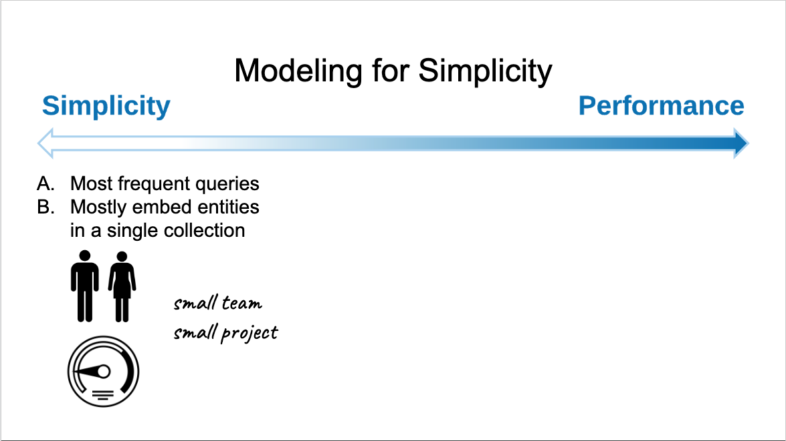

- Modeling for simplicity means we will avoid any complexity that could slow down the development of the system by our engineers.
- The most typical case would be developing an application quickly with one or few software engineers.
- Frequently, for those kind of projects, there are limited expectations and small requirements in term of CPU, disk, I/O, memory.
- Things are generally small and simple.
- You should start by identifying the most important operations for the system.
- And you will need to establish the relationships between the entities and fields.
- To keep the model simple, you are likely to group a lot of those pieces inside a few collection using sub- documents or arrays to represent the one- to- one, one- to- many, too many- to- many many relationships.
- By keeping the modeling steps to the minimum, we can remain very agile, with the ability to quickly iterate on our application, reflecting these changes back into the model if needed.
- **If you model for simplicity, as a result, you will likely see fewer collection in your design**
  - where each document contains more information and maps very well to the object you have in your application code
    - the objects being represented in your favorite language as hashes, maps, dictionary, or nested objects.

## Modeling for Performance

- In this scenario, resources are likely to be used to the maximum I like to compare this situation to an engine running at the red line.
- Project that makes use of sharding to scatter horizontally are likely to fall into this category, because you often shard your database because there is not enough resources available with a simple replica set.
- The system may require very fast read or writes operation, or it may have to support a ton of operations.
- Although situations are demanding a model for performance.
- More complex projects are often done by larger teams.
- And those larger teams will require a little bit more modeling upfront.
- When you model for performance or have more complexity to handle, you want to go over all the steps of the methodology.
- Again, you start by identifying the important operations, but also quantify those in terms of metrics like operation per second, required latency, and pinning some quality attributes on those queries such as-- can the application work with data that's a little stale, are those operations parts of the large analytic query?
- **If you model for performance you will often see more collection in your design.**
- You will also need to apply a series of schema design patterns to ensure the best usage of resources like CPU, disk, bandwidth.

## Modeling for Mix

- **Regardless of your project, you will need to start by identifying your workload.**
  - It can go from a simple identification of the most important operations to an exhaustive and complete description of the read and write operations.
- **Then, you need to choose between embedding or linking the model, the relationship.**
- `Simplicity will favor embedding.`
- **In the final phase, the more performance requirements you have, the more likely patterns will be applied.**

## Flexible Methodology

# Identifying the Workload

Following is the scenario:
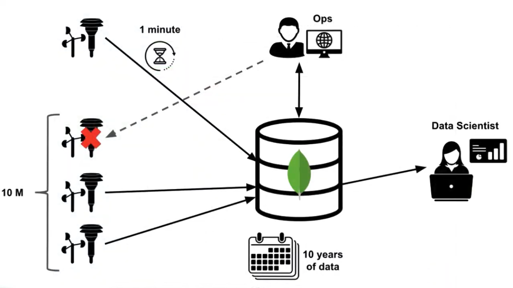
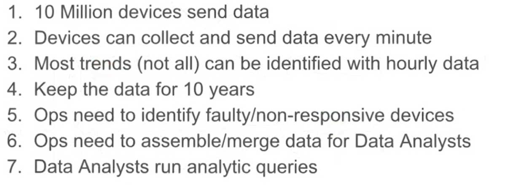

## Quantify vs. Qualify Operations

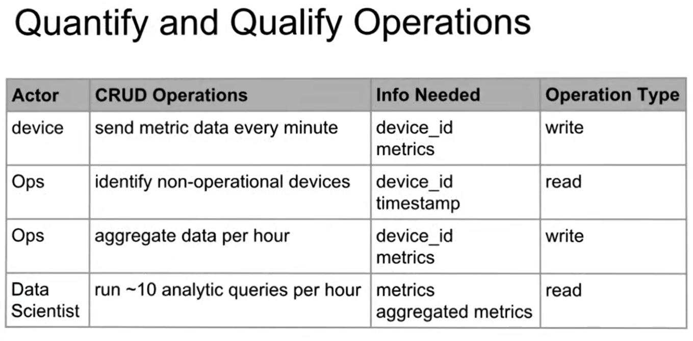

## Most Important Operation

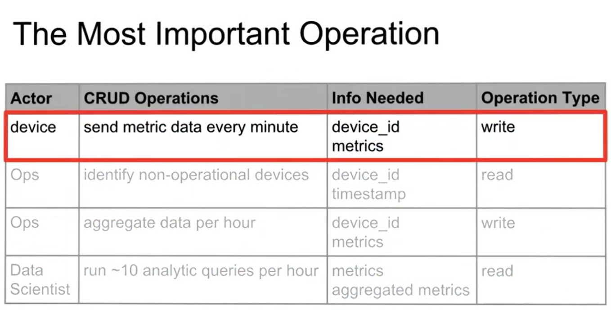

## Details of Write Operation

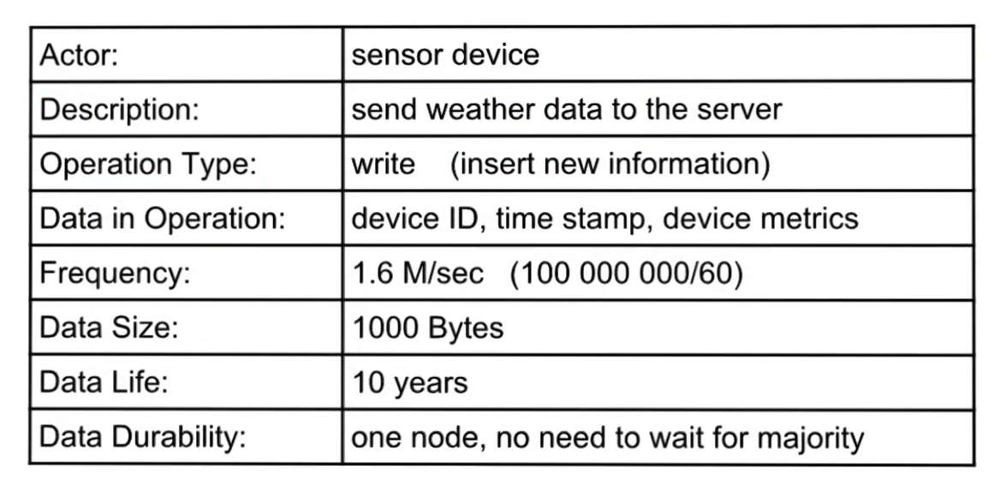

## Data Replication

As for the last point of Data Durability, we do not need to wait for the majority.

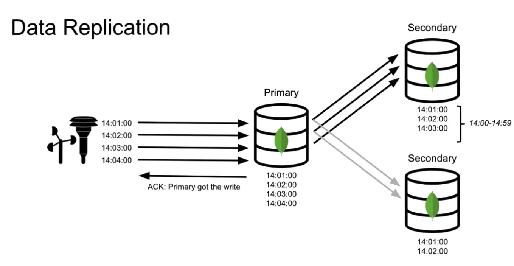

- Whenever we upload data on primary node then the data is replicated to secondary nodes.
  - We _will not_ wait for the Replciation Process to complete!

_Note: Another node can become primary. The tutor didn't explain this, just mentioned it_

### Data with Desired Durability

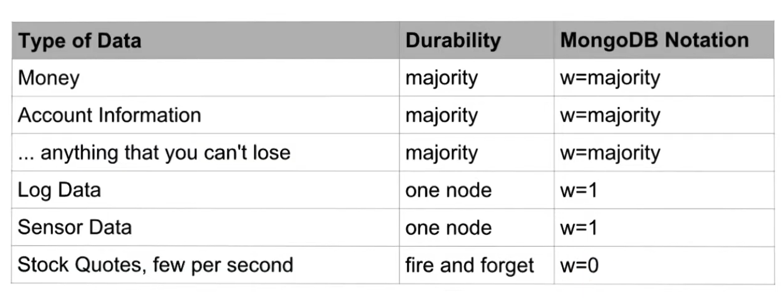

## Dedicated node for Analytics

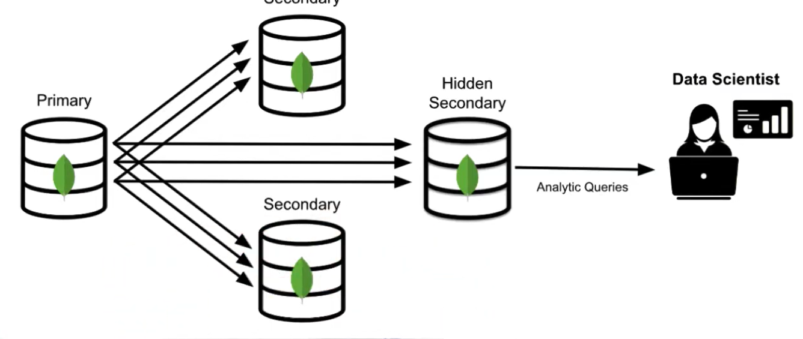

**`Please check the handout folder for further information`**
