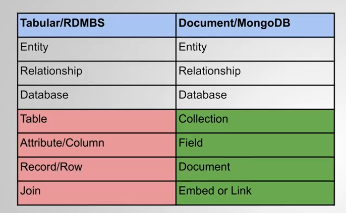
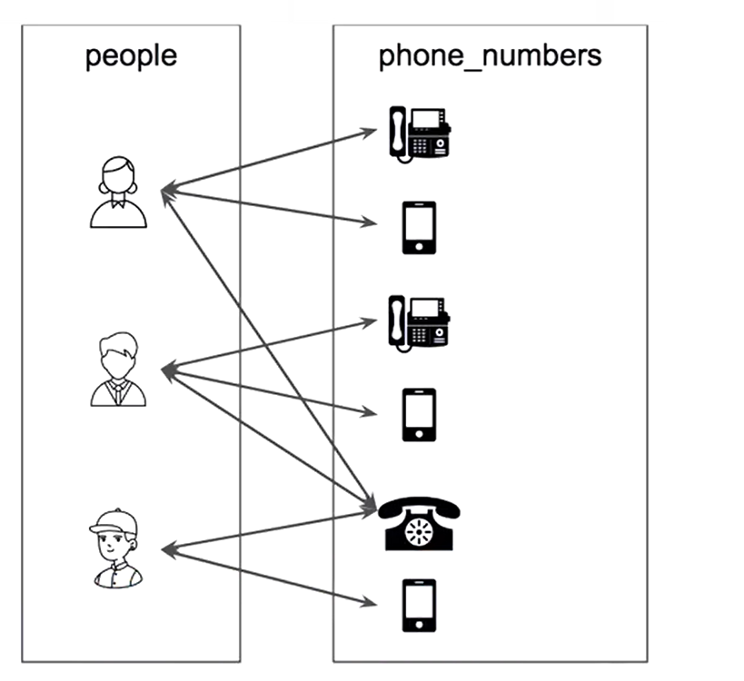

# Introduction

- SQL Databases are relational
- NoSQL databases are also relational
  - So it is better to call them **TABULAR**
    - Note: I saw this in Azure.

There are two options for relationship mainly in MongoDB

1. Embedding
2. Linking

Good Model ---> Best Performance

## What are Relationships in Data Models?

- In any of the database you study, you face **Objects called as Entities**

- In the following example,
  - `customer` and `invoices `has one-to-many relationship, i.e., one customer can have many invoices. _linked by customer_id_
  - `invoices` and `products` has many-to-many relationship because one invoice can contain many products and many invoices can be generated for one product.
    

## Tabular vs. Document [References]

# Relationship Types and Cardiniality

## One to One (1-1)

- It is often represented by grouping two pieces of data in one entity

## One to Many (1-N)

- It is represented by the following shape: 
- It is shown by connecting two entities:
  

## Many to Many (N-N)

- It is represented by the following shape: 
- It is shown by connecting two entities:
  

## Modified Notations

# One to Many Relationship

An object of given side can be associated with object of the second type.

## Embed vs. Reference in 1-N Relationship

## Embedding on "one" side

## Embedding on "many" side

## Referenceing on "one" side

MongoDB by default does not have the concept of foreign keys. Application needs to perform this operation itself.

## Referenceing on "many" side

## Recap

Option:

1. Embed
2. Reference

Duplication occurs when embedding on "many" side. But it is preferred for simplicity sake sometimes.

# Many to Many Relationship

**The many-to-many relationship is identified by documents on the first side being associated with many documents on the second side, and documents on the second side being associated with many documents on the first side.**

Trick to understand many to many model (my own as far as i have understood):

- If you can make one-to-many relationship from both sides then it is many to many

Note:
This relationship can trick you into thinking it is a one-to-many relationship, if you only consider one side of the relationship.
So ensure you ask the question of associativity from both directions, and that you review your model the few times, especially for these less apparent relationships.

- _In a normalized relational model, you can't actually link two tables as many-to-many._
- However, some design tools can do the extra work for you.
- Under the hood, an additional relationship table needs to be created to define this relationship, sometimes referred as a jump table.

**breaking up the many-to-many relationship into two one-to-many relationships linked together by our extra third table.**

Another example:

- Some of these phone numbers are exclusive, and some are not.
- A family's shares the home phone number
- So a person can have many phone numbers, and the phone number may be owned by many people, resulting in a many-to-many relationship.

**We can trick the relationship**

- We can treat the phone number for a home as uniquely owned by each member of the family by making copies of it.
- Now, we have a one-to-many relationship instead, which removes complexity.

Note:

- _if the family moves, we must modify each family's members phone numbers separately._
- Performing the same update multiple times may not sound like the right design, however, considered the previous design, where we store only one telephone number value in the database.
  - If someone moves-- like the child, for example-- and updates their phone number, the update will apply to all the members of the family.
    - We don't get the option to choose between doing multiple updates or one update that applies to all
- **Duplication is better, in some occasions, especially when you want to keep control**

## Many to Many Represetnation

### Embedding Main Side

- Usually we embed documents of the less queried collection inside documents of the more queried collection.
- Let's use the carts and items from our product catalog example.
- The **main entity is the cart** in which we want to find the items, not the reverse.
- We **embed the items in the cart**, because we always retrieve this information together.
- Having copies of items in the carts period is usually fine, because **they represent the state of those items at the time they were added to the cart**.
- The same applies to addresses and orders.
- The address used for that order at the time of the order creation _should be duplicated_.
- Observe that we need to keep a collection for the items.
  - _Item documents have different life cycle than cart documents._
  - There will be several other access patterns in your application that utilize items without

### Referencing Main Side

- When a document is retrieved, we will get the list of all the associated object's unique identifiers.
- If we need to add the information on these, we can use a second query or use lookup operator.
  - This is similar to join operation in tabular databases.

Following is the scenario of referencing in main side

Following is the scenario of referencing in secondary side

- The second representation of the many-to-many relationship that uses references is the one where we keep-- as we may have guessed-- the reference in another collection.
  However, there are few differences.
- Here, each store has a field called item sold that carries a list of references to the items sold in the given store.
- When we retrieve an item, we still don't know where it is sold.
- We need a second query to get this information, which was another case in the previous representation.
- A query like the following will return to stores in which the item with an ID of 10 or green MongoDB T-shirt has sold.

## RECAP

- Make sure that this many to many relationship cannot be simplified.
- Many to Many relationship can be replaced by two one-to-many relationship
  - This is not necessary in Document based Database i.e., MongoDB
- **EMBEDDING PREFERENCE**
  - Most Queried Side
  - Information that is primarily static + profit from duplciation.
- **REFERENCE PREFERENCE**
  - It is preferred over embedding when we want to avoid duplication.

# One to Many Relationship

- Tabluar database:
  - Represented by singular table.

Each of the following fields have one to one relationship with one another

## Representations

### Embed - Fields at same level

This is very similar to tabular representation

### Embed - Subdocuments

- Preferred Representation:
  - Preserves Simplicity
  - Documents are clearer.

### Reference

## Recap

- Prefer Embedding over Referencing
- Use subdocuments to organize the fields
- Use a reference for optimization purpose.

# One to Zillions Relationship

- It is used for humungous data.
- 0 is minimum number, 1K is most likely number, 100M is highest number

## Representation

