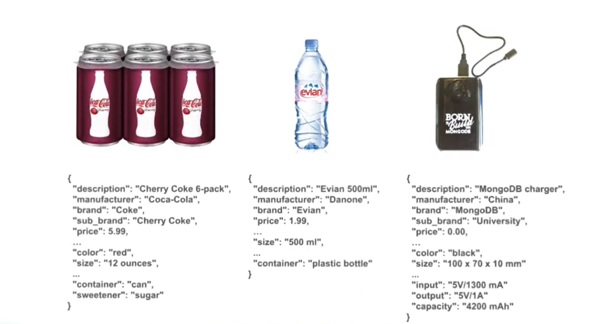

# Attribute Pattern

**`Polymorphic, one of the most frequent schema design patterns used in MongoDB.`**

Polymorphic is when you put different products, like these three examples, in one collection without going through relational acrobatics.

- Our products should have an identification like manufacturer, brand, sub-brand, enterprise that are common across the majority of products.
- Products' additional fields that are common across many products, like color and size-- either these values may have different units and means different things for the different products.
  - For example the size of a beverage made in the US maybe measured as ounces, while the same drink in Europe will be measured in milliliters.
  - For the size of a Cherry Coke six-pack, we would say 12 ounces for a single can, six times 12 ounces, or 72 ounces to count the full six-pack.
- Then there is the third list of fields, the set of fields that are not going to exist in all the products.

  - You may not even know where they are in advance. They may exist in the new description that your supplier is providing you.

  - For a sugary drink, you may want to know the type of sweetener, while for a battery, you are more interested in its specifications, like the amount of electricity provides.
  - For the characteristics that are almost always present, we keep them as fields those qualify as the common schema part.

To search effectively on one of those fields, you need an index.

- For example, searching on the capacity for my battery would require an index.-
- Searching on the voltage output of my battery would also require an index.-
- If you have tons of fields, you may have a lot of indexes.-
- Remember some of the characteristics may be very specific to a few products and the list of fields may be unpredictable.-
- Each addition or discovery of a new characteristic may require you to add an index, modify your schema validators, and modify your user interface to show the new information.-
- **For this case you want to use the attribute pattern.**

- To use the attribute pattern you start by identifying the list of fields you want to transpose.
  - Here we transpose the fields input, output, and capacity.
- Then for each field in associated value, we create that pair.
  - The name of the keys for those pairs do not matter.
  - Only for consistency, let's use K for key and V for value, as some of our aggregation functions do.
- Under the field name K, we put the name of the original field as the value.
  - For the first one, the field was named "input," so that became the value for K.
- Then the value for input was five volts or 1,300 milliamps, so this is the value for the field V.
- Repeating the same thing for the original field's output and capacity, we get three documents, each adding a K and a V in them.
- Because of their similar shape it is easy to place them together under an "add_specs" for additional specs array.
- Note that for the third field, not only do I transpose it to a key value pair, but that also added a third field called U to store some units separately.
  - This third field qualifies the relationship between K and the V.
- The last thing to do is to create an index for all that info.
- This is done by creating an index on "add_specs.k" and "add_specs.v."

## Common Characterstics

- Let's look at another scenario.
- Let's say we have a document representing a movie.
- In the document, there are several fields to keep track of when the movie was released.
- In this case, we keep track of the dates when a movie was released in the USA, in Mexico, and France, and when it appears in the San Jose movie festival-- a very nice festival.

- One thing to observe with those fields is that they share the same type of value.
  - In this case, the type, date - more conceptually, a release date.
- **What if we want to find all the movies released between two dates across all countries?**
  - I would have to list all the countries in the festival for each of these, run a separate query for the given range, and aggregate all my results.
- **Using the attribute pattern and transforming those release dates to an array of field pairs, we can change the query as shown in the right side.**
- In practice, you will save the date as "date" or "isodate" objects.

## Summary

- Let's reorganize a little bit around what we've been describing and illustrating.
- **The attribute pattern addresses the problem of having a lot of similar fields in a document.**
  - Often, those fields have similar value types.
  - Or there's a need to search across many of those fields at once.
- **This pattern is also helpful when only a subset of the documents have many similar fields.**
- **The solution would be to transform fields from the field value form into a sub-document with two fields, a sub-document of two key value pairs.**
- And the range contains these sub-documents.
- _And then you can create a single index to catalog all those attributes._

It is an Orthogonal Pattern to Polymorphism
Add organization for:

- common characterstics
- rare/unpredictible fields
