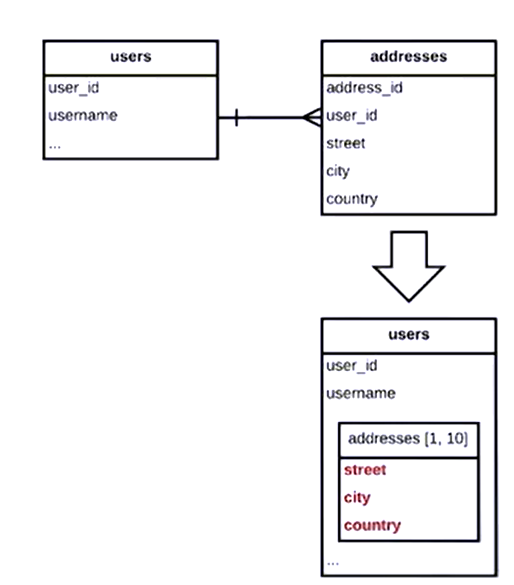
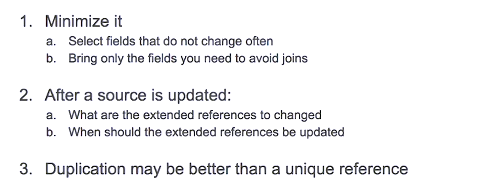
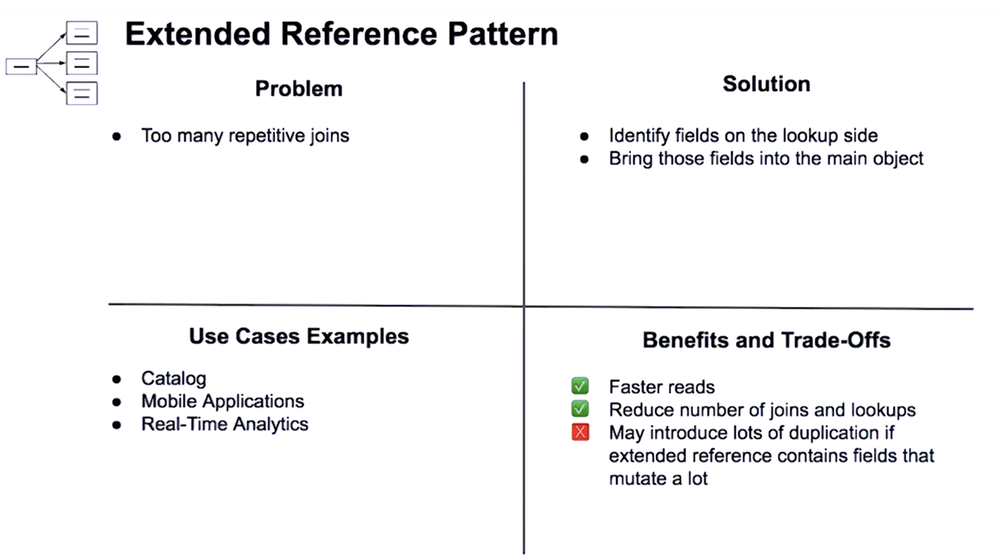

# Extended Reference Pattern

- Do you have nightmares about long and complex SQL queries performing too many joins?
- Even if you migrated from a 10 tables relational model in the tabular database to a 3 collections model in MongoDB, you might still find yourself doing a lot of queries that need to join data from different collections.
- For sure, your MongoDB queries are nowhere going to be as complicated as in SQL.
- But in the world of big data, anything you do too often can become a liability for your performance.
- **There are a few ways you can do joins in MongoDB.**
  1. Application
     - You retrieve a document from one collection and perform a second query that retrieved the linked documents in the second collection.
  2. Lookup
     - Now the aggregation framework supports joins through the $lookup operation.
     - There is also a $graphLookup operator to perform recursive queries over the same collection, a recursive self-join, similar to the ones you find in graphed other bases.
  3. Avoid Join By Embedding The Document:
     - There is one more method, and it is to avoid doing a physical join.
     - You can embed a one-to-many relationship on the one side.

- Now, what if the join is coming from the opposite side?
- We want to join the one side into the many side.

- An example will be a collection of orders which have a many-to-one relationship with a customer.
  - One customer can have many orders, and one order belongs to one customer.
  - **A many-to-one relationship is, in fact, a one-to-many relationship looked at from the opposite side.**
- Let's say that our applications focus is on order management and fulfillment.
  - And we will query for specific orders way more often than query all the orders for a given customer.
  - In other words, the center of attention is more often the order for this type of query.
  - _If we want to embed the information from one side, for example, the address of the customer, into the order, we are duplicating this info in all orders._
- **The preferred way to do this duplication, which we identify as our extended reference pattern, is only to copy the fields you need to access frequently, leaving the rest of the information in the source collection.**
- _Basically, instead of adding a simple reference from the document in the invoice collection to this one in the customer collection, we built an extended reference, meaning the reference is rich enough, that we will not need to perform the join most of the time._

## Managing Duplication

- Every time we talk about duplicating data, it is worth understanding the consequence.
- The first thing to understand is how to minimize duplication.
- 

- **The extended reference pattern will work best if you select fields that do not change often.**
- **Also, only bring the fields you need.**
  - For example, the user ID of a person can be complemented by his name, as people rarely change their name.
- When we look up an invoice, we may want to see the list of products with their supplier name.
- But there is little reason to show the phone number of the supplier at this point.
- If we want additional information, we can solve the supplier collection.
- Then, when the source field is updated, identify what should be change, meaning the list of extended references, and the when should they be changed.
- For example, it may be necessary to update them right away.
- However, sometimes it is OK to leave the data alone and update it later in a batch, when you have available resources.
- For example, changing the ranking of my best-selling products does not require me to instantly update all the products that spell out the rank of the product on their page.
- Interesting enough, the example we use with invoices and addresses is a case where duplication is not a problem, but rather the right solution.
- When the invoice was created, the customer may have lived in one location, and they have moved since.
- If we were to keep the last address of the customer in a reference in the invoice, we will be pointing to the new address, not where the products of this invoice were shipped.
- In this case, we want the invoice to keep pointing to the old address.
- The characteristic of the invoice that make it work well are the fact that the invoice is created at a given time in the timeline, and the invoice remains static over time.
- Any other entity sharing those characters is likely to work the same way, in the sense that duplication is not an issue, but a good thing.
- Time to formalize our extended reference pattern.
- The problem the extended reference pattern addresses is avoiding joining too many pieces of data at query time.
- If the query is frequent enough and generates a considerable amount of lookups, pre-joining the data can be done by applying this pattern.
- The solution is to identify the fields you are interested in on the looked up side and make a copy of those fields in the main object.
- You will see this pattern often used in catalogs, mobile applications, and real-time analytics.
- The common thread here is to reduce the latency of your read operations or avoid round trips or avoid touching too many pieces of data.
- You will get faster reads, due to the reduced number of joints and lookups.
- The price you will pay for the improvement in performance is the fact that you may have to manage a fair amount of duplication, especially if you embed Many-to-One relationships, where the fields change or mutate a lot.
- Here you go.
- This is our extended reference pattern.

## Summary

