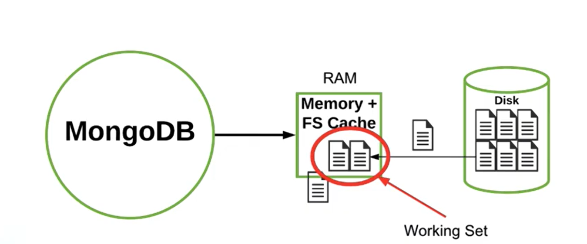
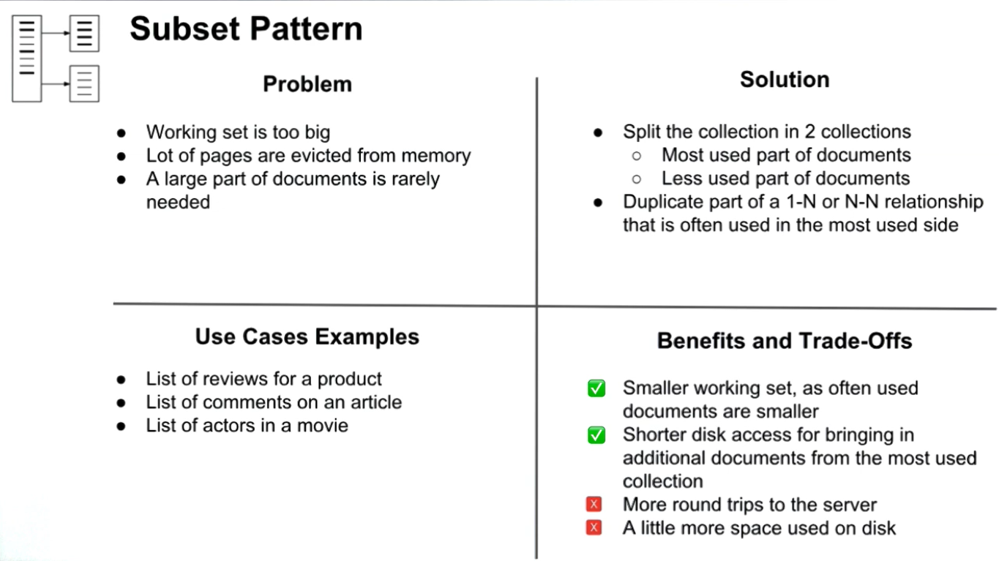

# Subset Pattern

## Working Set

- Already Studied. RAM stores frequently accessed data.
  

**Big Working Set Produced 'RUN OUT OF MEMORY ERROR!'**
Solution:

- Add RAM
- Scale with Sharding
- Reduce the size of Working Set (reduce document size)

Reducing Size - How?

- Moving some fields with One-to-One Relationship
- Moving some fields with Many-to-One Relationship

## Summary

