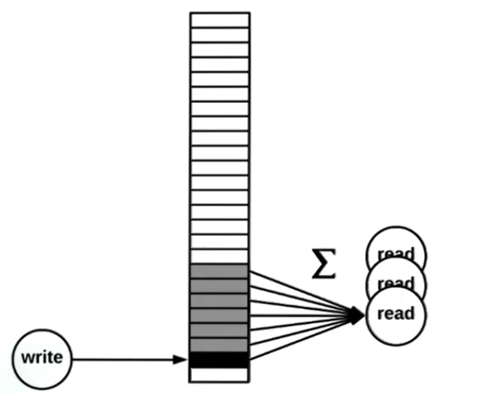
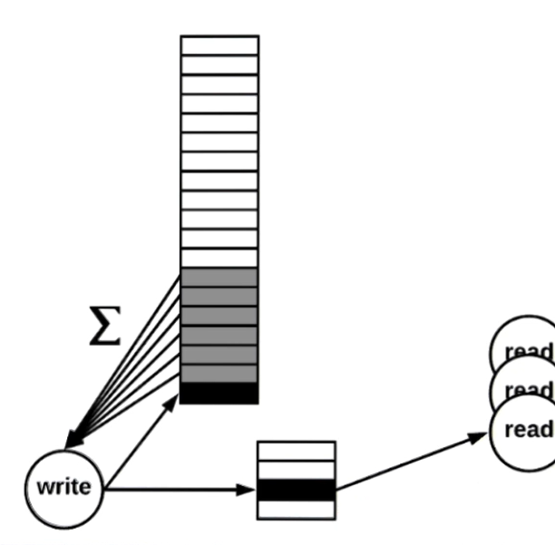
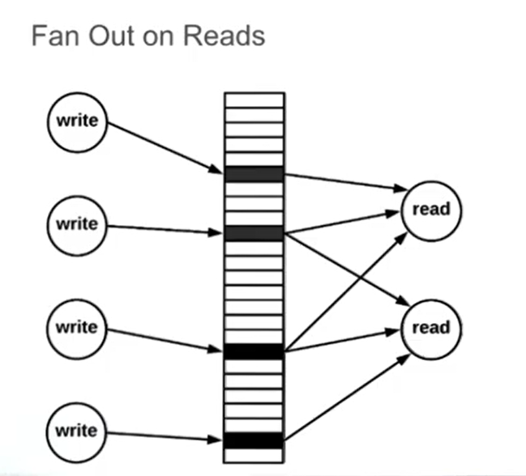
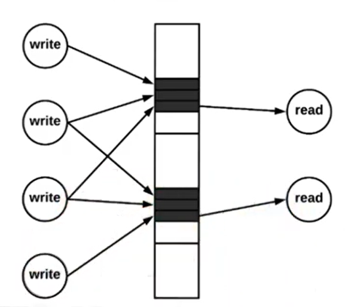
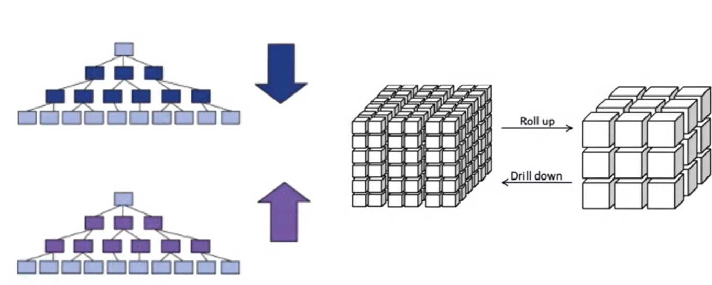
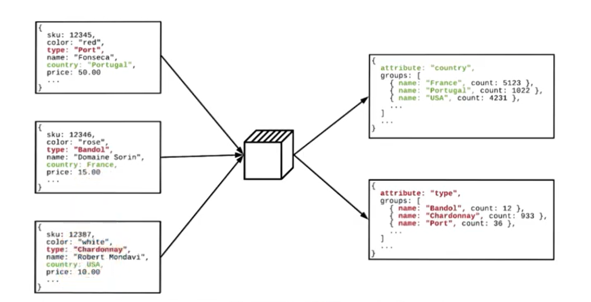
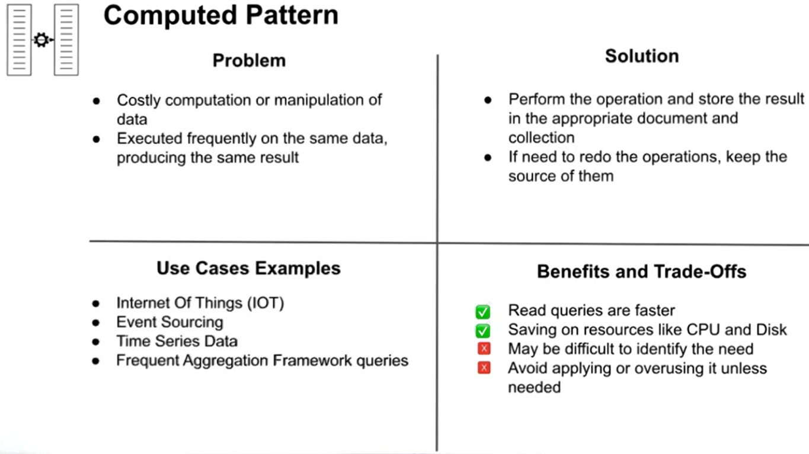

# Computer Pattern

We need to calculate a value that is displayed **100 times a minute** and is based on a field which **updates once a minute**.

## Mathematical Operations

- The mathematical operations are easy to identify.
- These are the ones where we compute a sum or an average, find a median, et cetera.
- These are often associated with calling a built-in function in the server.
- Why does it matter that we want to apply a pattern here?
- Let's say we have a write operation that comes in.
- This piece of data is added as a document to a given collection.
- Another part of the application reads this collection and does, let's say, a sum on the numbers.
- If we are doing 1,000 times more reads than writes, the sum operation we do with those reads is identical and very often does the exact same calculation for each of those read operations.
- We can save ourselves from all those identical operations by calculating the results when we get a new piece of data.
- Once we have a new piece of data, we read the other element for the sum and store the result in another collection with documents more appropriate to keep the sum for that element.
- This results in much fewer computation in the system, and we also reduce the amount of data being read.

- See here, each sum reads all those documents.
- Since we don't have to do the computation that at read time, we also save on those read operations, too.
- In this example, that will be 1,000 fewer computation and 1,000 fewer reads.

- A good example of this will be keeping track of ticket sales and then reporting the sale numbers-- let's say for a specific movie-- on a movie website.
- There are likely fewer screening happening per hour, which will be all right, than page views for the given movie where we want to display the sums.
- So instead of summing those screenings document to display the total viewer and sales every time access the movie, we are better off keeping the information in the document and updating it every time we get a new screening document.
- We don't have to keep the screenings once the calculation is done.
- However, the idea was to regenerate the sums if needed, or give us the ability to do more analytics.

## Fan Out Operations

**It means to do many tasks to represent one logical task.**
There are two basic schemes.

1. Fanout Reads
2. Fanout Writes

### Fan Out Reads

In order to return the appropriate data, the query must fetch data from different locations, or you found out on writes, which means every logical write operation translate into several writes to different documents.

In doing so, the read does not have to fan out anymore, as the data is pre-organized at write time.

### Fan Out Writes

If the system has plenty of time when the information arrives compared to the acceptable latency of returning data on read operation, then preparing the data at write time makes a lot of sense.

Note that if you are doing more writes then reads so the system becomes bound by writes, this may not be a good pattern to apply.

A good example for this pattern will be a social networking system for sharing photos.

The system may copy the new photo on each follower's home page as it gets the new photo.

This way, when a user load its own page, the system does not have to spend resources assembling all the information from all the people this user follows.

Everything needed for the user's home page would be available via single document, which lead to a much better experience with the site.

## Roll Up Opeartion

- We use this terminology in a position to drill-down operation.
- **In the roll-up operation, we merge data together.**
  - For example, grouping categories together in a parent category will be a roll-up.
- Grouping time-based data from small intervals to large ones will be another good example of a roll-up.
  - This type of roll-up is often seen in reporting for hourly, daily, monthly, or yearly summaries.
- Any operation that wants to see data at a high level is basically looking at rolling up data.
  - Mathematical computations are roll-ups.
- However, _roll-ups are more generic_.
- **You can often think of roll-up data as running a group operation.**
- So similarly to mathematical computation, doing those roll-ups at right time may make more sense than having our read operation pay the costs of processing the transformations.

- Let's look at a concrete example.
- An inventory has different wine types.
- The inventory change once in a while, however, not frequently.
- What is more frequent is looking at the wine organized by various categories.
  - For example, I may want to see the count of wine types per country of origin or per type so I can buy what is missing in my inventory to cover all my customer needs.
  - If I'm looking more often at the information on the right, the non-aggregated data than the changes that are happening on my collection on the left, it makes more sense to generate this data and cache it in the appropriate documents.

### When should you apply the computed pattern?

## Summary

