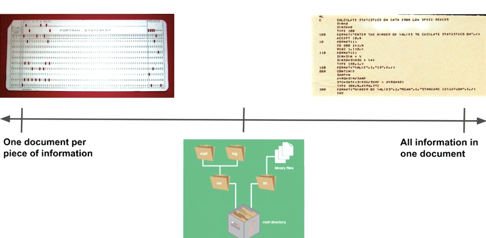
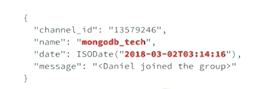
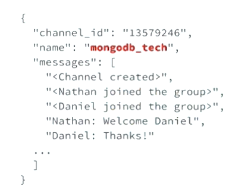
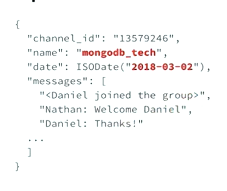
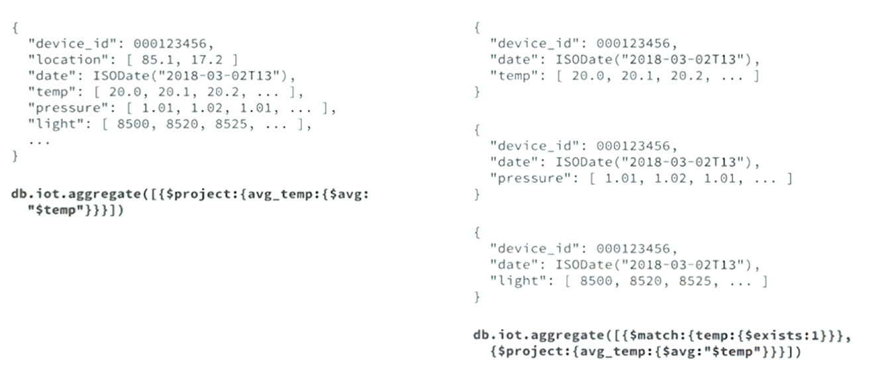
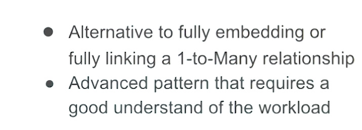

# Bucket Pattern

This concept of grouping information together is called `bucketing`

- In the early days of programming, you would feed the giant computers with punch cards, like this one on the left.
  - Each instruction would store on a separate card.
  - It was preferable to not draw the ordered stack of cards, especially if you did not use some kind of label to reorder them.
- Just a little later, the advent of terminals permitted the developers to put all these instruction in a file, like the one we have on the right.
  - However, as programs got bigger, the files got larger, and it was not a viable solution anymore.
- The solution at that time was to group a set of instructions together.
  - Call it files, classes, libraries-- this is still the system in use today.
- **The point I want to make is that sometimes you need a middle-of-the-road solution, because both extreme are not working well and far from being optimal.**

  - The punch card is too granular, while the single file solution is too broad and does not provide enough granularity.

- Translating that to MongoDB and the document model, let's look at an **example** of **Internet of things devices**, which I will refer as IoT for the rest of the lesson.
- Let's say we have 10 million temperature sensors, and each sensor is sending us a piece of data every minute, the temperature it's measuring.
  - This is 36 billion pieces of information per hour.
- Trying to store each piece in a document may not work as we get too many documents to manage.
- On the other end, if we keep one document per device, each document is likely to reach the maximum size of 16 megabytes after a while.
- Even if it does not reach that size, it may still be unmanageable and not very efficient to handle these large documents.
- So what should we do?
- Here, we'll make some suggestions.
- However, if you recall their methodology, the suggestions make more sense if we know the workload of the problem and the main queries of our system.
- **One suggestion is to have one document per device, per day.**
  - Each document would only carry information for a single device on a single day.
  - Then the next day, we will create a new document.
  - I decided to create one array per hour.
    - This translates in an easy to understand document for a human.
    - However, it makes it a little bit more complicated for a program.
    - If the application wants to average a temperature for a given period, it needs to retrieve the array or the section of the array for each hour of that period and do the calculation.
    - If this is a common query, then maybe a single array for the whole day makes more sense.
- **Another option is to have one document per device, per hour.**
  - Here, our time stamps includes the date and the hour.
  - We have one document for 1:00 PM and one document for 2:00 PM.
  - There are more documents, 24 times more than this example.
    - However, the documents are smaller.
  - Note that I'm also using a different way to store the temperature values.
  - Here, instead of using a single array, we use a document where the keys are the minutes.
    - In the first set of documents, I must fill the empty positions.
    - For example, if I don't get the data for the fifth minute, I must put something-- zero or null, but something.
  - As for these documents, I simply insert the values I receive.
  - In the event I did not get a piece of data for the fifth minute, the field temp dot five will not exist.
- **Again, there are a ton of possible configurations.**
  - **So unless you know the workload, it is difficult to tell which one is the best.**
- **This concept of grouping information together is called `bucketing`.**
- And as you guessed, the bucket pattern is often used in the IoT scenarios.

- Here's another example.
  - We will build a collaboration platform.
  - The platform will have chat windows that we'll call channels.
- **One solution is to keep one document per message.**
  
- However, this may become messy and may require more processing to organize the messages together.
- **An alternative is to keep all the messages for a given chat in a single document**.
  
- That may work, but over time, each document may become bigger than what we want, as we care more for a recent message than the old one.
- **Again, the middle solution will be to arrange the messages in the bucket-- All messages for a channel for a given day.**
  
- One nice thing about this design is that it's very easy to delete documents older than x days, or then archive them.
- I can use zone charting and move my old messages to a chart that resides on cheaper hardware.
- One final note on this example.
- When you think about bucketing, you refer to two independent variables.
- One will be the big container, the main document, here identified by your underscore ID.
- And the other part of the one-to-many relationship will be your bucket.
- This is where you will put N piece of data from the one many relationship in the bucket.
  **Summary of the collaboration example:**
  

- That brings us to the **last use case** I want to describe.
- **The NoSQL database family is composed of document databases like MongoDB, but also for the members like key value databases, graph databases, and column-based databases.**
  What if our solution requires a document databases for most use scenario? **But** one use case scenario is better served by a column-based database.
  
- A column-based database stores information per column instead of per row or document.
  - So when you want to process only one column across all the documents, like it is frequently done in analytics, it's very efficient, as it brings in memory only the data it needs.
- As you know, MongoDB brings in memory full documents.
  - If we have a use case that will benefit a lot from a column-based approach, we could install a separate database next to MongoDB to handle this use case.
  - However, in order to make our deployment model as streamlined as possible, adding different technology for this alone will come with an unnecessary technical complexity.
- **Let's use MongoDB to model data that is column-based oriented.**
- Going back to our earlier example of IoT device, let's assume these device that returns a bunch of information like temperature, pressure, and lightning.
- If we were to store all the info for a given device in each document, we could query across variables.
- However, this ability is not needed.
  - But what is really needed is to process all data regarding one field at the time, meaning one column, for example, the intensity of light.
    - We may want to break up the measurement in many documents so processing one type of data does not require bringing everything in memory.
- When processing light, we bring these documents in memory.
- When processing pressure, we bring these documents in memory.
- Note that both sides are using the bucket pattern.
  
- It is just that the one on the right has a structure more similar to columns.
- Also, know that information for the device, like the location and anything else about the device, has been left out of the documents on the right side and put somewhere else.
- If you need to search or aggregate results on these fields, you should keep them in the documents.
- Again, this is not going to be as optimal as a column-based database system.
- However, it's a good work-around if you don't want to install two database systems.

Let's look at some restriction or gotchas when using the bucket pattern.

- If you need to frequently access elements in the buckets to do updates, deletions, or want to insert in specific locations, this may not be the best pattern to use.
- If you need to get the data sorted in any way, it is preferable to have it sorted in the buckets themselves.
- In this example, all the temperature in the buckets were already sorted by date and time.
- Ad hoc queries may be difficult to do, as you need to understand the underlying structure.
- So this pattern works better when the storage representation is hidden [INAUDIBLE] by the application.

Time to formalize our bucket pattern.

- The problems the bucket pattern address are helping us size our documents to satisfy the combination of read and write operations of our workload.
- This helps embed a one-to-many relationship, where the many side is too big or grows beyond bounds.
- The solution is to find the optimal amount of info, then store it in arrays or arrays of arrays in our main objects.
- The one-to-many relationship is transformed so the one side becomes N documents.
- What are the common use cases?
- Obviously IoT systems, then data warehouse is a good candidate, as you can analyze larger chunks of time-based data at once.
- In short, any one object that has ton of information associated to it.
- The right size of your documents will translate into the right number of disk accesses and the right amount of data transfer by these accesses.
- It makes the data more manageable.
- For example, it is easy to delete section of your data by simply deleting the documents corresponding to that period.
- On the trade-offs, ensure you know all you want to query the data.
- If every query translate to an aggregation query, that will first [INAUDIBLE] the data, the schema you choose may not be the right one.
- Also, it may not be friendly to all BI Tools, as your users need to understand the schema to do the queries.
- What may have been a simple MongoDB or SQL query may become much more difficult to express.
- So this is our bucket pattern.

Summary

- In summary, the bucket pattern is a great pattern if you want a middle ground solution between fully embedding and fully linking data.
- However, this is an advanced pattern that should be used only when you have a good grasp of your workload.
