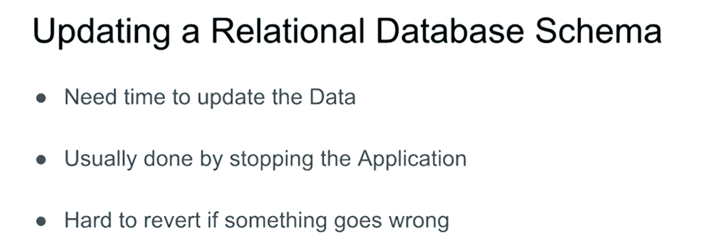
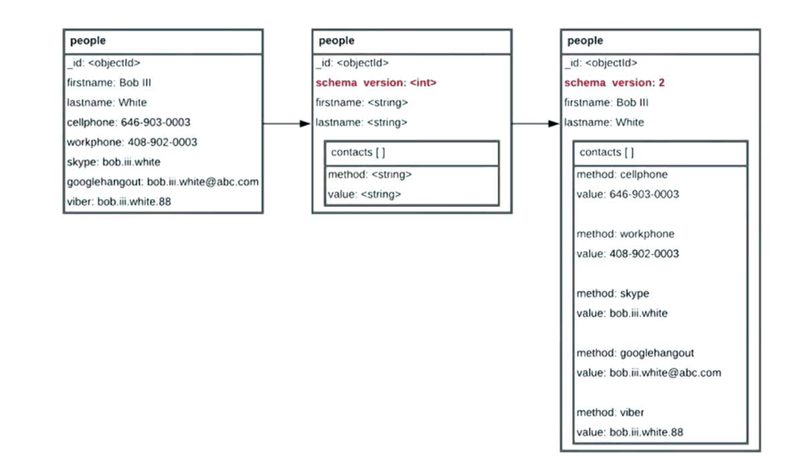
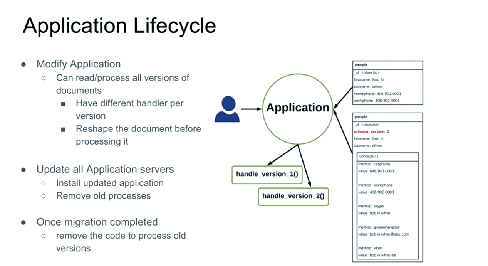
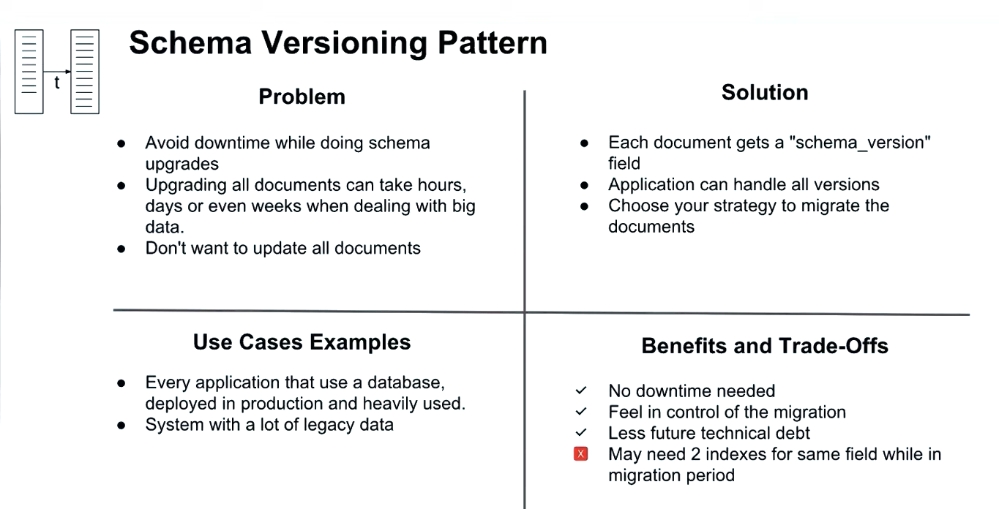

# Schema Versioning

- Do you still have alter table nightmares?
- Memories of modifying the schema of your relational database?
- Performing complex tasks under pressure, so you could limit the amount of downtime for your users?
- If so, welcome to your new world.
- If you did not have any nightmares or never updated relational databases, welcome too to this bright world.
- You will love the pattern we will cover in this lesson.

## Updating DB Schema

- **It makes modifying the schema used by your application a much smoother process.**
- The question when user database is not, if you will update your schema, **but when would you update it?**
- **Nearly all applications in their lifetime will require updates to their database schema.**
  
- Unfortunately, those updates take time and require downtime for relational databases.
- If anything goes wrong when you reopen the service, it may be difficult to revert back to what you had prior to the migration.

## Understanding Schema Versioning

- The schema versioning pattern is based on the _polyphormic_ aspect of documents in MongoDB.
  
- Because documents can have different shapes.
- By that, I refer to having different fields or different types for a given field.
- We construct our applications to deal with those variants.
- Let's say we have Bob White as a person in our people collection.
  - Bob was born a while ago, and can be reached at home or at work through these phone numbers.
  - Then we have Junior, Bob White's son.
  - Bob is from a generation that got used to cell phones.
  - And we need to add this information to his profile, and have our application deal with this additional information.
  - I suspect making this change was not too painful.
  - It would even be pretty smooth with a relational database, as adding a column is not a big deal.
  - Now, as the next generation of White-- Bob III-- does not have a phone at home.
  - However, has account with Skype, Google Hangouts, Viber, and who knows what next week.
  - Well, this is becoming difficult to handle in the application.
  - But because the developers took the wonderful class Entry 20 on Data Modeling, they realized that the **attribute pattern** would be a good fit here.
    
  - So instead of growing the documents with unpredictable contact methods, the attribute pattern is applied.
  - The application could easily handle the differences in the Bob White documents. It just has to know the different shapes.
    - Here, instead of dealing with an additional field, you get to see an array of contacts method when you process it accordingly.
  - To help the application identify the shape, we will have a version field and set it to 2, the non-presence of this field being the implicit version 1.
    - **`Note that this field is present in each document.`**
  - **This is in contrast to a relational database, where you only have one global number to track the version of the schema.**
- Here we have each document telling us which version of the schema to adhere to.

- The first thing you will need to do is to change the application so it can read all the different version of the documents.
  - You can use separate handlers or function to handle the different versions.
  - The field schema version makes it easy to decide where to send the document.
- Alternatively, reshape the document when you see an old version, and then process it.
  - Testing that functionality is relatively easy.
- As you start adding documents with the upcoming shape to your test environment, and then observe how the application deals with those changes.
- Update your application server so they use the modified application.
- Once the migration of all documents is completed, it's up to you to decide to remove or not the obsolete code.

- New documents get written in the latest schema version.
- For existing documents, you can piggyback on the fact that you're going to make an update to change the shape and write it in the new schema.
- As a matter of fact, I remember a customer that had billions of documents, a lot being inactive.
- And that was their only migration strategy.
- That means that the old obsolete documents remained unchanged, because they did not want to pay the price to update them with a job running for a few weeks.
- Alternatively to this selective update strategy, the most common one is to have a background task to do the updates.
- You can have both processes doing the migration of documents, and that will still be fine.

- The thing to understand is that while you're updating your application server, assuming you have more than one, you won't face any downtime.
- Once done, you can take the time you need to update the documents by running an updater.
- And that can be done in a few passes.
- **While the documents are getting updated, your application servers can handle both schema version work well with all documents, old and new shapes.**

  - At the end, if and once all documents are updated, you can remove the code to handle the old version in your application.
  - Some users keep it there for protection or for keeping the ability to reimport documents in the old shape.

## Formalizing

- Time to formalize our schema versioning pattern.
- The problem in schema versioning pattern addresses is avoiding downtime when using a schema update.
- If you have a small system with the ability to bring it down for an acceptable period of time, you may just want to do that and do your updates the old fashioned way.
- Updating all documents can take a long time-- hours, day, or even weeks when dealing with big data.
- And there is the situation where you have so many legacy documents, or any other reason for which you don't want to update everything.
- As illustrated in our previous screens, the solution is to use a field present in each document to keep the version number.
- Schema version is suggested, but not mandatory.
- As a matter of fact, the field can also be omitted, and have the application detect the shape or the version based on the list of fields present or missing.
- However, I prefer explicitly using a field to identify the version.
- Secondly, the application should be able to handle the different shapes of the documents.
- And finally, layout the strategy to migrate your documents.
- You are in charge.
- You have all the time you need to do the things correctly.
- As I said earlier, most application-- especially the successful ones that live for a long time-- will require schema changes.
- Unless you can afford downtime, this pattern is likely going to be very useful to you.
- On the benefits side, they are pretty evident.
- You can avoid downtime.
- You feel in control of the migration the whole time, done when you want to do it.
- On the trade-off side, if you have an index in the field that's not located at the same level in the document, you may need to index while you're doing the migration.
- And finally, unlike the fiscal debt, the technical debt, and environmental debt we are usually leaving to the next generation, at least here we can build system that should be easier to maintain and migrate by your future colleagues.
- **In summary, the schema versioning pattern is a great pattern if you want to avoid downtime while performing schema upgrade and want to stay in control of those upgrades.**
