# Tree Pattern

## Lecture Notes of Video

Note that this pattern is different from most of the other patterns, as it offers four different variants for its implementation.

In the video, we use a check mark to emphasis that the pattern does support the query.

When we use an exclamation mark, we want to denote that it is possible to support this query, however, it may take more work in the application code, such as the use of multiple queries.

Documentation page on Model Tree Structures:
https://www.mongodb.com/docs/manual/applications/data-models-tree-structures/

## Video

- **We are going to learn about how to model hierarchical information using tree patterns and examine common situations where tree patterns can be used.**
- There are several types of use cases that find hierarchies between objects or nodes and the relationship between them, use cases like company organization charts, subject areas structures in a given domain like books in a bookstore, or even a more typical example, the categories of products for a given e-commerce site or shop.
  - All of these examples are hierarchical in nature where there is a direct relationship between the parent nodes and the child nodes.
- Each hierarchical node relationship comes associated with common operations that will be useful to us in many situations regardless of the actual content of the database.
  

- Things like who are the ancestors of node X or reports to Y.
- Find all nodes that are under Z, or change all categories of N to under P.
- These are common operations applicable to any information that is hierarchical in nature.

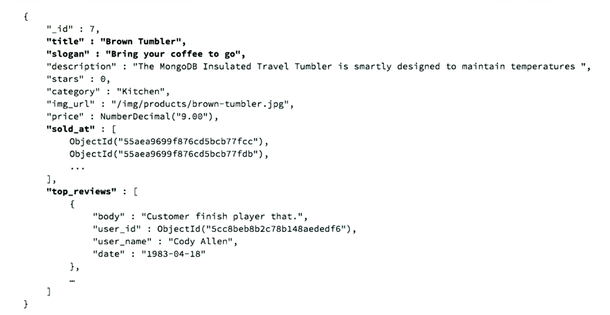

- Documents, in themselves, are hierarchical structures.
- They contain multidimensional information within a given node, such as the relationships between a product and the stores that the product's sold at or the reviews of the same product.
- **However, when representing the dependency and hierarchy between nodes of the same entity, like categories, it is better to use tree patterns**.

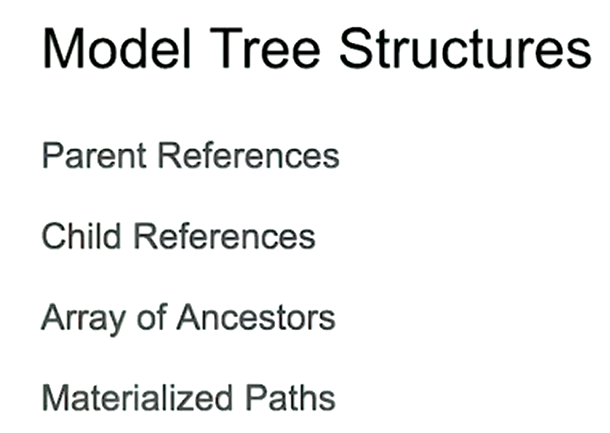

- The document model offers a few patterns for modeling tree structures.
- We have the parent references, child references, arrays of ancestors, and materialized baths.

### Parent Reference

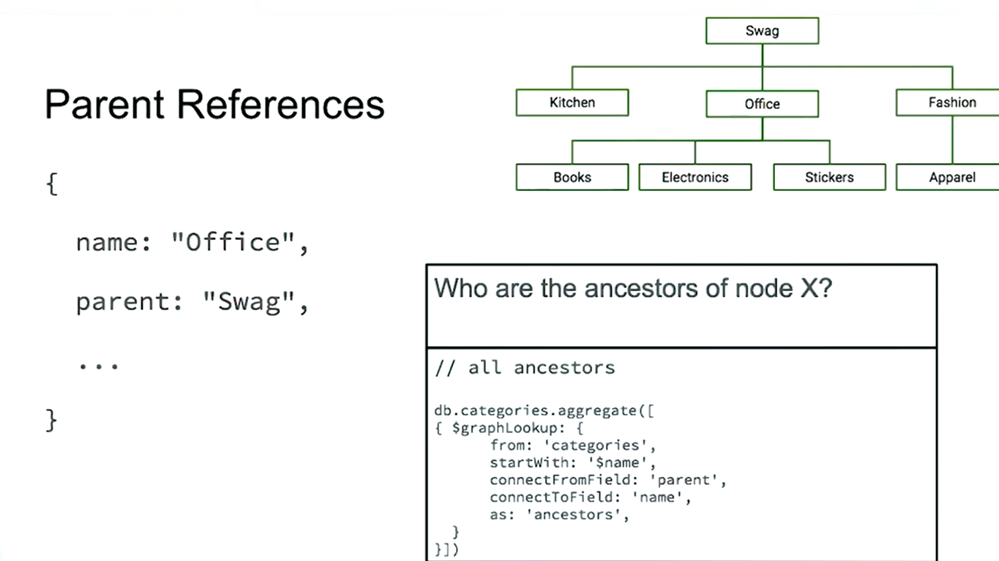

- In the case of parent preferences, the document holds a reference to the parent node in the tree hierarchy.
- We can collect all ancestors by running an aggregation pipeline with a graph lookup stage to retrieve all subsequent parents of the immediate parents traversing the full tree.
- To find all reports of a given parent, we can run a find command matching for the parent and then retrieving all children nodes.

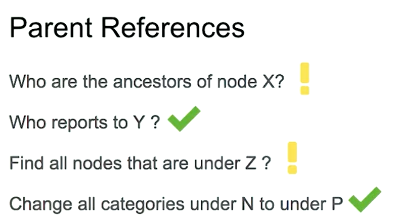

- In order to change all nodes that report, or are children of one parent, in other words, change all categories under N to children of P, we can use an update operation.
- For parent references, we can perform operations like who reports to Y and change all categories under N to under P using very little code and changing only one single document.
- To find all nodes that are under Z, that is also pretty straightforward.
- However, we have to iterate over a set of documents.
- We can also respond to questions, Who are the ancestors of node X, by resorting to a lookup, which is essentially as joined, which may not be ideal to accomplish this operation.
- This is where the child reference model comes in.

### Child Reference

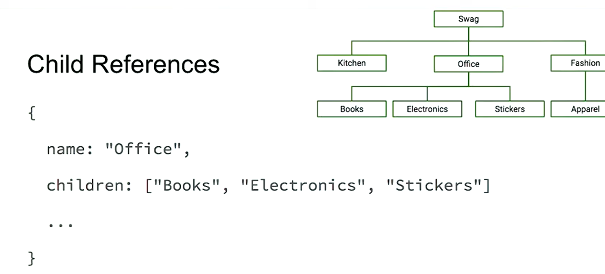

- In the child reference model, the parent node contains a single array of all the immediate node children.
- In this example, the office node has three children-- books, electronics, and stickers.
- So to perform the operation finding all nodes that are under Z, in this case, under office becomes a less computational demanding operation for the database.
- A single request retrieves all of that information.

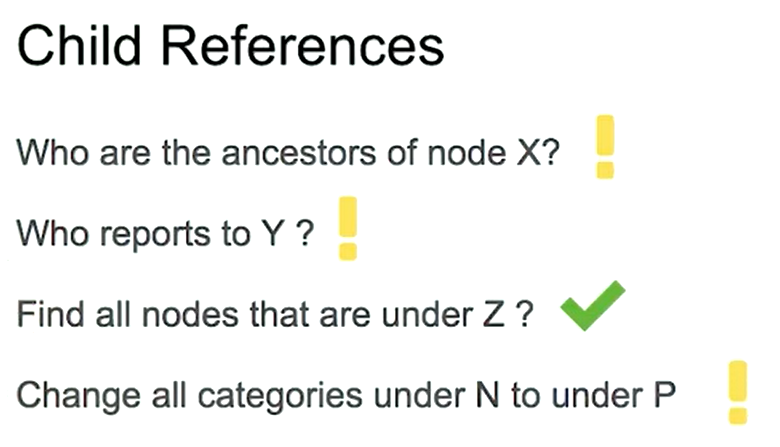

- However, other questions like, who are the ancestors of node X, become a bit more complicated.
- Finding all nodes that report to Y or even changing all categories under N to under P are not ideal for this pattern.
- Another model to represent the hierarchy of a tree is the array of ancestors model.

### Array of Ancestors

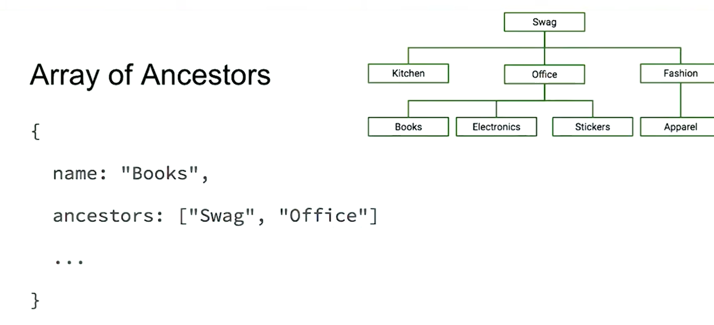

- This model uses an ordered array to store a list of all of a node's ancestors on that node.
- This model is very efficient for finding what are the ancestors of a given node.
- They are all stored in the ancestor array.
- We can also find out which is the immediate reporting or parent node using array position operators if we know the level that the node occupies in the tree.

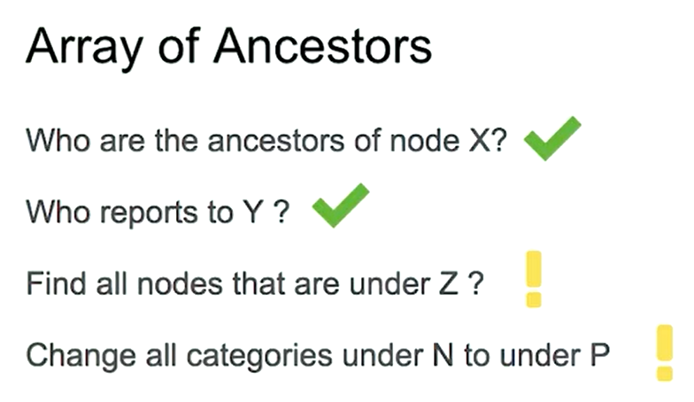

- The next operation, which is still possible, a bit more tricky to do, is to change all categories under N to under P, since this operation requires a few more trips to the database to apply all the necessary changes.

### Materialized Paths

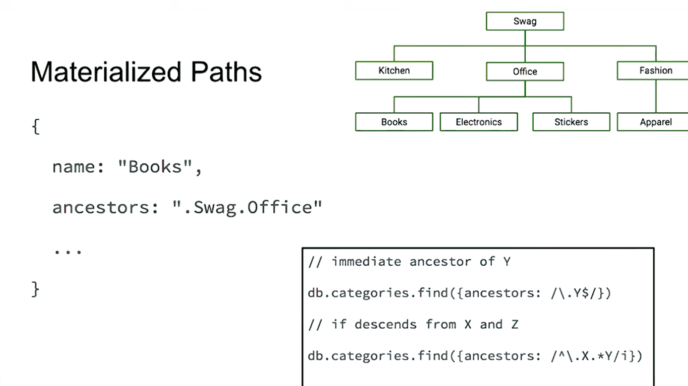

- A variation of the array ancestors is the materialized paths pattern.
- In this approach, we use a string value to describe the node's ancestors with some value separator.
- In this example, we have a string ancestors with a value .Swag.Office.
- That describes the direct branch of the books node in the tree.
- Using the materialized path's approach comes with a great benefit.
- We can use a single regular expression over a single index field value for all queries prepended on the root tree node, which means that we can use a simple index in order to find a particular path of a branch in our hierarchy.

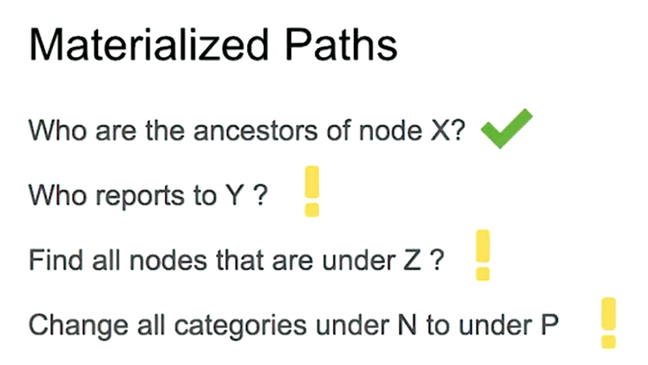

- In this approach, we can access our ancestor's fields to quickly answer the question, who are the ancestors of X?
- For the question, who reports to Y, this is a simple query but potentially not very efficient, even relaying on a single field.
- The index will not be used if we do not ask for the full branch matching path from root.
- Finding all nodes that are under Z suffers from the same problem as reports to Y.
- And finally, moving nodes around might be quite challenging depending on the node that we are moving and the reports that subsequent node in the hierarchy chain.

### MongoMart Solution

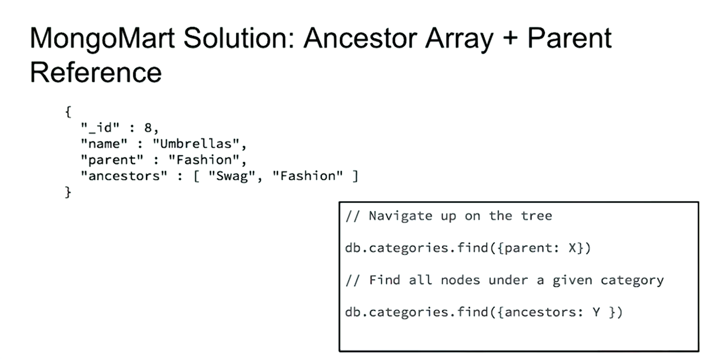

- For any given application that relies on hierarchical information, there is nothing stopping us from using any combination of different patterns in our model.
- As an example, here is the categories collection which represent the categories of products in our e-commerce application.
- In this example, we are using both the array of ancestors and the parent reference model.
- And why did we decide to use this combination of patterns?
- We want to be able to do a couple specific operations very quickly and without lots of unnecessary logic.
- These operations include navigating to the immediate parent node and finding all categories of products that descend from a given node.

### Formalization

- Tree parents are used to model hierarchical data structures.
- There is a good variety of tree patterns that we can apply as a solution for those same hierarchical data structures modeling.
- These are generally used in org charts, product categories, and others.
- The different patterns offer different benefits.
- Child references are ideal to navigate the descending the hierarchical of nodes of our tree, where on each node, we can find the immediate child references.
- Parent reference is ideal to navigate upwards in the tree in institutions where the tree is constantly being updated or moved.
- Array of ancestors is ideal to get a full view of a branch of the tree structure up to the node itself, where materialized path is an alternative to use a single field index on a string value that enables the user to regular expressions to find documents in a branch of the tree.
- Tree patterns are an effective way of representing these use cases.

### Recap

- Documents are very good data structures to represent nodes in a tree.
- The fact that documents can hold parts or branches of the tree within themselves allows us to represent in a very efficient way models that do not rely on suboptimal drawings to retrieve the hierarchical information we require for each node.
- There are several different ways to represent nodes of a tree using documents, and you can even use a combination of different patterns in your model.
- The choice of which patterns you use should be based on which are the most common operations that your application will be performing and optimized for those choosing the best pattern that allows you to do the most efficient queries on that particular application.
