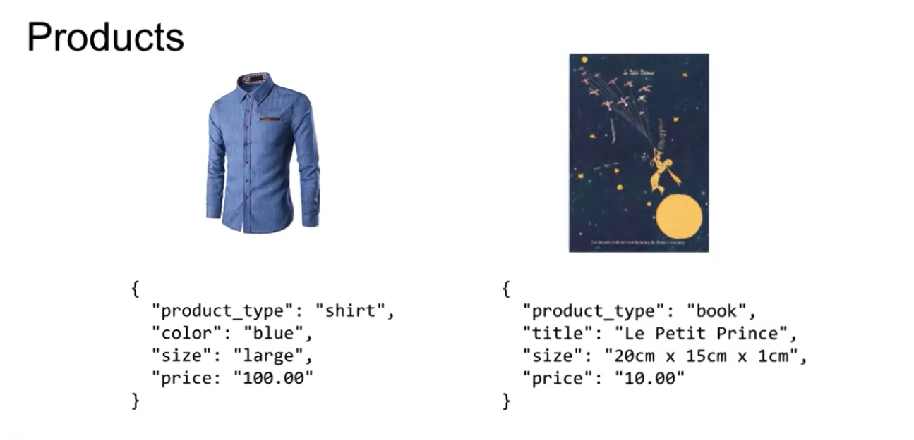
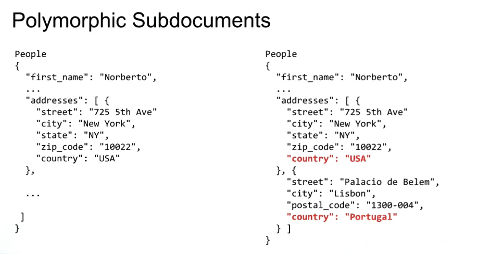
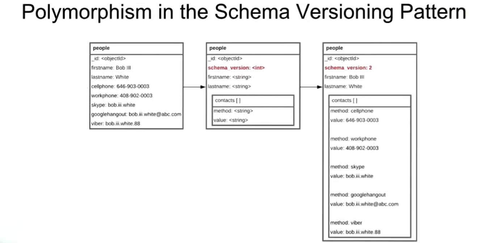
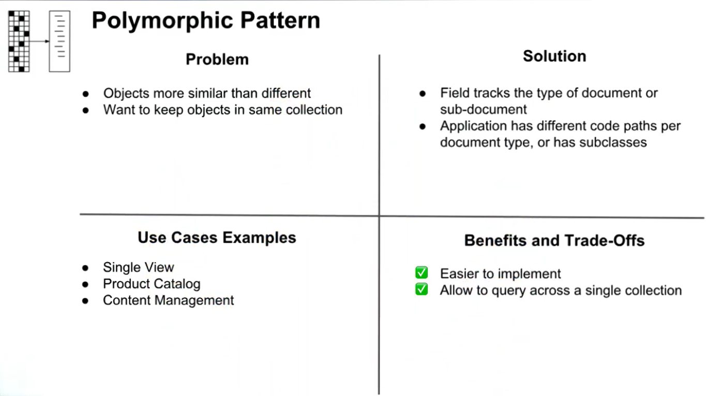

# Polymorphic Pattern

## Introduction

- When we want to organize objects, we can either group them by what they have in common or by their differences.
- This will result in either keeping the documents in the same collection or in different collections.
- For example, if we have a product from Canada, a product from Mexico, a customer from Canada, and a customer from Mexico, it is likely that we will group the two customers together and the two food items together.
- We usually group objects based on queries we want to perform on the system.
- **A major restriction with most other base systems is that it is difficult to query objects across different tables or a collection.**
- If there is one collection for the customers and the one collection for the products it becomes more difficult to find all things Canadians, for example.
- If the main query of this system is that they're mining objects and people by country, then we will probably put together everything in one collection.
- So we should group things together because we want to query them together.

- When grouping objects together that may have substantial differences, for example, using a vehicle collection to store cars, trucks, and boats, and other types of vehicle would lead us to query the vehicle for registration, ownership, vehicle taxes.
- A specific vehicle type may have specific aspects that are not shared with the other types of vehicles.
- A car typically has four wheels, which we can omit.
- Other trucks have a variable number of wheels and axles.
- While the boat usually has none.
- **These differences make a car, or truck, and a boat polymorphic entities for a vehicle object.**
- The usual implementation that represents polymorphic objects as a `field` that describes the name of this shape for a given document or sub-document.
- In our current example, a vehicle type identifies the document type and lets the application and all the expected field for a particular type or shape of the document.
- The document of type car will imply that the vehicle has four wheels, while the truck should have a field to identify the number of wheels in the field to identify the number of axles.
- Due to the nature of the document model, there is usually polymorphous in our database.
- **We refer to the polymorphic pattern in our schema designs when we can clearly name the different entities that are represented in the same collection.**

- Another common situation when this pattern can be applied is when dealing with a product catalog application.
- Some products may have a color, like a shirt, for example, while describing a book by this color rarely makes sense.
- **In this situation, we're also using polymorphism.**
- However, in a more casual way, as there are tons of different product types.
- In this case, it's up to you to spell out that they are using the polymorphic pattern in your schema design.
- So far, we discussed a polymorphic document type in the context of a shape of a document.

## Polymorphic Subdocuments

- **However, we can also apply this model to subentities, such as sub-documents.**
- For example, if we take a person, let's say, Norberto, Norberto is Portuguese and lives in New York.
  - So he has an address in the USA.
  - It is a typical urban address in the US, with a building number, street name, city name, and zip code.
- Norberto has also an address in Portugal.
  - This structure is similar to the address in the USA.
  - However, a well-known building in Portugal may not have a building number.
  - Portugal does not use zip code.
  - However, they have a critical post style, which translate to a postal code.
  - The critical post style is 7 digits long.
- So if we want to have a valid data on the postal code or a zip code, they will have to be a little bit different, as they have to handle 7 and 5 digits, respectively.
- Because our addresses are the documents that we want to apply the polymorphic pattern to, each of these documents need a field to specify its shape.
- We could use an additional field, however, in this case, the country name should do it.
- **Based on the country for a given address, we can determine the shape of that sub-document.**
- **`The polymorphic pattern is commonly used when implementing a single view solution.`**

## Single View

- **A single view solution allow for the aggregation of data from different sources into one central location.**
- It is common that the different sources exist because systems tend to be designed to deal with one single problem.
- An integrated view is key to gaining meaningful insight across all this data, but it's often difficult to merge these data sets together.
- A typical tabular or relational database approach to solving this problem tends to be very complex, resource intensive, and incomplete.
- We've seen several organizations over the years failing to create a relational schema that could accommodate data from different sources, different relational database schema, or different data sets.
- The complexity of this problem becomes greatly reduced when users decide to use MongoDB to create this unified view of the data.

- Imagine an insurance company that has acquired many other insurance companies over the years.
- Each acquired organization represents their insurance policies in a different way, using a different schema in their tabular or relational database.
- When a customer calls the insurance company, they need to specify which system the specific insurance policy is stored in and access the given system.
- It is possible that some customers had policy with several of these insurance companies, which means that they would have multiple policies across the different systems.
- For example, some home policy may be in System A, while his car policy may be in System B.
- Imagine the mess it creates and the impact it has on the customer, who is not able to receive a single unified policy.
- **By creating a single view that merges all sources of data into one MongoDB database, the organization is able to see all the policies and information about the given customer on their one single system.**
- In this example, we are bringing data from different sources into one common collection.
  - First, we select the field that we want to use to identify the customer ID.
    - Let's say we want to use the Social Security number.
  - Second, maybe some fields are easy to merge.
    - Let's say that the first and the last name of the person can be easily identified in the different sources, and they carry the same values.
    - That will result in keeping only this shape for this field.
    - Pick the field name you want, however, the values are the same.
  - Finally, some fields may be more messy and difficult to merge.
    - For example, let's say that addresses have proven to be difficult to clean and represent uniquely.
    - For that, we can keep a list of variants found in the different databases.
    - We can confirm the right value with the customer later or write a separate intelligent process a few months down the road to unify these three sub-documents.
- **This approach help us be operational very quickly, and then we can improve the information we extract in an incremental fashion.**

## Polymorphism in Schema Versioning Pattern

- Before we wrap up this lesson, let's quickly mention that this schema versioning pattern is using the polymorphic pattern.
- Its implementation can be described as a version field that dictates the shape of the document.

## Formalizing Knowledge

- And let's organize what we've been describing and illustrating.
- The problem that the polymorphic pattern addresses is allowing us to keep documents that have more common things in the same collection.
- The solution is to have a field that keep tracks of the shape of the document or sub-document.
- Then have the application use different code paths to handle the differences in the documents using that field value.
- If the differences are substantial, we often have subclasses allowing the different concerns in the base class to handle the similarities.
- **This is classic object-oriented programming.**
- The most common use cases for this pattern are single view implementations, product catalogs, and content management applications.
- This is a pattern that is relatively easy to implement.
- It reflects very well one of the main advantages that the flexible document model offers us.
- So this is the overview for polymorphic pattern.

## Summary

- In summary, the polymorphic pattern is a basic pattern.
- A lot of other patterns are, in fact, a specialization of this pattern.
- We can also use the polymorphic pattern in a more generic way to store different shapes of documents within the same collection.
