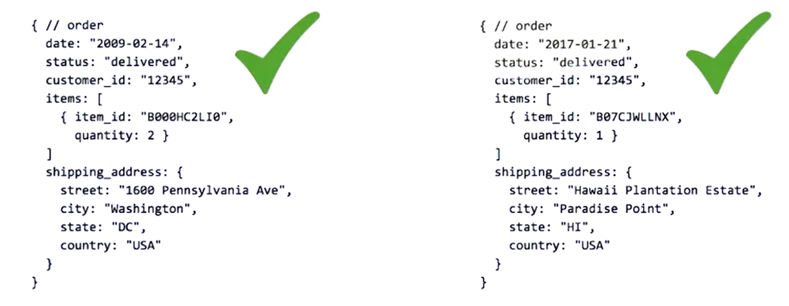

# Patterns

- Most power tool to design Schemas
- Pattern is re-usable and provides a part of a solution to a huge problem.
- **Book: Design Patterns - Elements of Reusable Object-Oriented Programming**

# Applying Patterns

# Handling Duplication, Staleness and Referential Integrity

## Duplication

- Why?

  - Result of embedding information in a given document for faster access.

- Concern?
  - Challenges for correctness and cosistency.

### Case 1 - Duplication is a solution

Information should be embedded (WITHOUT REFERENCE) in a case where a snapshot of information is required in time.
For example, a customer ordered something, so in orders table, we stored the address of customer but afterwards, the customer changed his address. The address in the order table must not be changed in this case.

### Case 2 - Duplication has minimal effect

This is the many to many relationship.
In order to avoid duplication, we'll need to 2 collections and create references between the documents.

Once the movie is released, list of actors do not change.

### Case 3 - Duplication should be handled

- For this example, let's use the revenues for a given movie, which is stored within the movie, and the revenues earned per screening.
- In this case, we have duplication between the sum store in the movie document and the revenue store in the screening documents used to compute the total sum.

- This type of situation, where **we must keep multiple values in sync over time**, makes us ask the question:
  - Is the benefit of having this sum precomputed surpassing the cost and trouble of keeping it in sync?
    - If yes, then use this computed pattern.
    - If not, don't use it.
- Here, if we want the sum to be synchronized, it may be the **responsibility of the application** to keep it in sync.

  - _Meaning, whenever the application writes a new document to the collection or updates the value of an existing document, it must update the sum._

- But how often should we actually recalculate the sum?
- This brings us to the next concern we must consider when using patterns, **staleness**.

## Staleness

Google: **the property of being pure and fresh (as if newly made); not stale or deteriorated.**

Example:

- Price of the item must be checked at the time when it is placed and at the time of checkout to see if any change occured?
- To check if the item of the product to be checked out still exists or someone else bought it?

Why?

- New events come along at such a rate that updating some data constantly causes performance issues.

Concern?

- Data quality and reliability

**Change Streams** are used to resolve staleness. Please review it in detail with the following documentation:
https://www.mongodb.com/docs/manual/changeStreams/

## Referential Inegerity

Why?

- Linking information between documents or tables
- No support for cascading deletes

  - At this time, the MongoDB server does not support foreign keys and associated cascading deletes and updates responsible for keeping referential integrity.
  - It is the responsibility of the application to do so.
    Challenge?

- Challenge for correctness and consistency

_Referential integrity has some similarities to staleness._
It may be OK for the system to have some extra or missing links, as long as they get corrected within the given period of time.

## Recap

